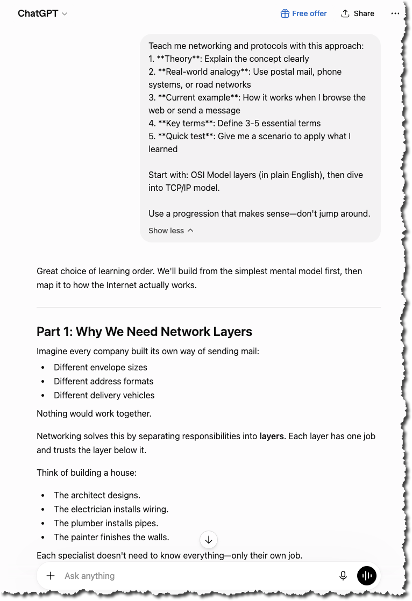
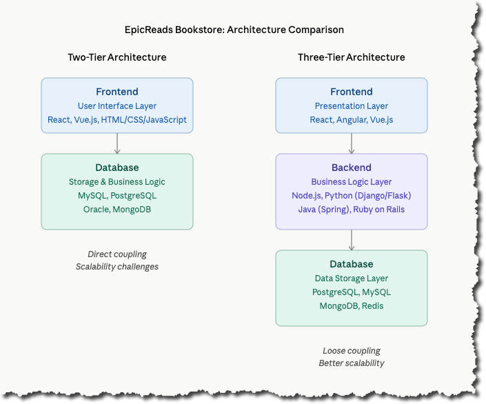
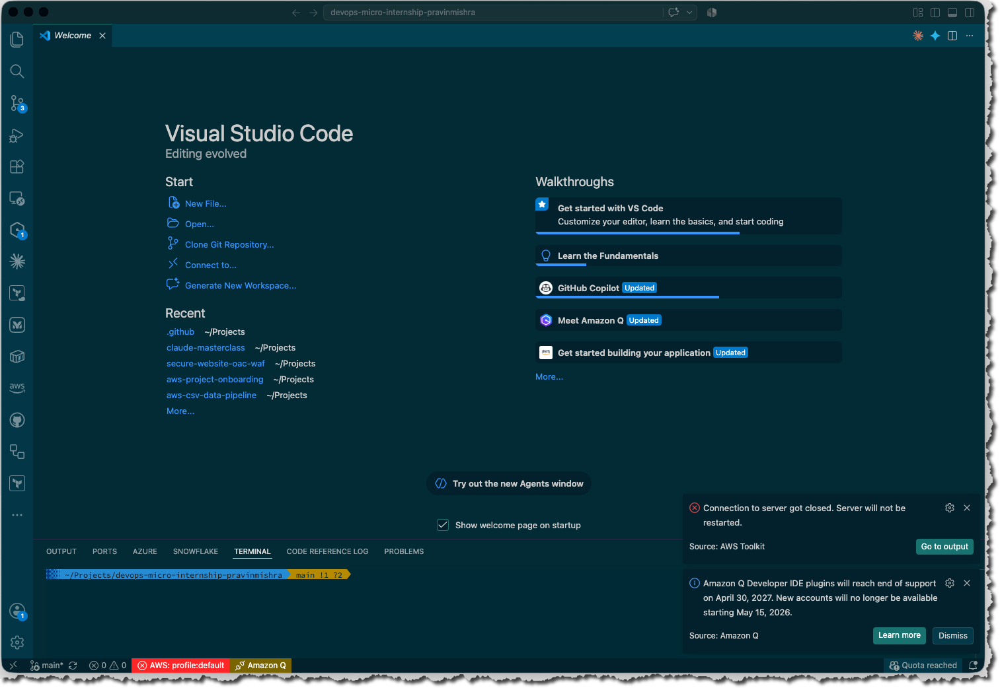

# Week 00 - Internet and Networking

Part of the DevOps Micro Internship (DMI) Cohort 3 with Agentic AI

---

# 🧑‍💻 Task 1: Using ChatGPT as Your Learning Assistant

## Scenario

You're new to DevOps and will frequently encounter technical questions. ChatGPT can be your learning companion.

## Your Task

Write a clear ChatGPT prompt to help you understand:

> "What is a protocol in networking? Explain with a simple real-life example."

Take a screenshot of your interaction showing:

* Your detailed prompt (with clear expectations)
* ChatGPT's simplified response with an example

## Screenshot

Save your screenshot in the `screenshots` folder and update the file name below.




Replace `task-1-chatgpt.png` with your actual screenshot file name.

---

## What I Learned (2–3 lines)

I learned that networks are systems where computers exchange data through agreed-upon rules called protocols. The OSI model helps organize these rules into 7 layers, and TCP/IP is the most common protocol suite used on the internet. Understanding IP addresses, DNS, and HTTP showed me how my everyday internet activities actually work behind the scenes.

---

# 🌐 Task 2: Internet and Networking

## Scenario

Your friend is launching an online bookstore named **EpicReads**.

He asked you to explain how users globally can access his website hosted in Finland.

## Your Task

Write a short explanation (**100–150 words**) that includes:

* Packet Switching
* IP Address
* TCP/IP
* HTTP/HTTPS

💡 **Tip:** You may use ChatGPT (as demonstrated in Task 1) to refine your explanation.

## Answer

When users worldwide access EpicReads.com, several networking technologies work together:

First, their browser uses TCP/IP, the foundational protocol suite that enables internet communication. The user's device looks up EpicReads' IP address (the server's unique identifier) through DNS, allowing it to locate the website hosted in Finland.

Next, your friend's server uses packet switching—breaking the website data (HTML, images, text) into small packets that travel independently across different routes through the internet, then reassemble at the user's device. This ensures efficient data delivery even if some routes are congested.

Finally, HTTPS encrypts the connection between the user's browser and the Finland server, protecting sensitive bookstore data like passwords and payment information during transmission.

Together, these technologies enable seamless, secure global access to EpicReads.

---

# 🏗️ Task 3: Application Architecture & Stack

## Scenario

EpicReads bookstore has two application versions:

### Two-Tier Application

* Frontend
* Database

### Three-Tier Application

* Frontend
* Backend
* Database

## Your Task

* Draw simple diagrams (hand-drawn or tool-based such as draw.io)
* Label each layer clearly
* List at least two common technologies or tools used for each layer
* Submit a screenshot or photo clearly showing your own drawing

## Diagram Screenshot / Photo

Save your diagram image in the `screenshots` folder and update the file name below.




Replace `task-3-diagram.png` with your actual diagram file name.

---

## Technologies Used

### Frontend

* **React** or **Vue.js** — Modern JavaScript frameworks for building interactive user interfaces
* **Tailwind CSS** — Utility-first CSS framework for responsive, modern UI design
* **Redux** or **Vuex** — State management library for handling complex application data
* **Axios** or **Fetch API** — HTTP client for communicating with the backend API

### Backend

* **Node.js with Express** — Fast, scalable JavaScript runtime and web framework
* **Python (Django or Flask)** — Robust frameworks for handling business logic and API requests
* **RESTful API** or **GraphQL** — API protocols for frontend-backend communication
* **Authentication (JWT or OAuth 2.0)** — Secure user login and session management

### Database

* **PostgreSQL** — Reliable relational database for storing book catalog, orders, and user data
* **Redis** — In-memory cache for faster product searches and shopping cart management
* **MongoDB** — NoSQL option for flexible document storage (reviews, metadata)
* **Elasticsearch** — Search engine for fast book searching and filtering by title, author, genre

---

# 🌍 Task 4: Domain Name & DNS (Basic Concepts)

## Scenario

Your friend's bookstore **EpicReads** is currently accessible through:

```text
52.172.142.222:3000
```

He purchased the domain:

```text
epicreads.com
```

## Your Task

In **50–100 words**, explain in your own words:

1. What is DNS (Domain Name System)?
2. Which DNS record type should be used to connect the domain to the given IP, and why?

## Answer

1. DNS (Domain Name System) is a system that translates human-readable domain names (like epicreads.com) into IP addresses (like 52.172.142.222). When users type epicreads.com in their browser, DNS acts like a phone directory—it looks up the domain and returns the correct IP address, allowing browsers to find and connect to the server.

2. Use an A record to connect epicreads.com to 52.172.142.222. An A record maps a domain name to an IPv4 address. Since 52.172.142.222 is an IPv4 address (four numbers separated by dots), the A record is the correct choice. Once configured, users can type epicreads.com instead of remembering the long IP address.

---

# 💻 Task 5: Visual Studio Code Setup (Hands-on)

## Your Task

Install Visual Studio Code (if not already installed).

Take a screenshot of your VS Code environment showing:

* Terminal open inside VS Code
* Running a basic command:

### Windows

```powershell
dir
```

### Linux / macOS

```bash
pwd
ls
```

* Your selected VS Code theme clearly visible

⚠️ **Important:** The screenshot must show your username or another identifiable detail to confirm it is your environment.

## Screenshot

Save your screenshot in the `screenshots` folder and update the file name below.




Replace `task-5-vscode.png` with your actual screenshot file name.

---

# 🔗 Task 6: Publish Your Assignment as a LinkedIn Post

## Objective

Publishing on LinkedIn helps you:

* Build your professional online presence
* Reinforce your learning
* Document your DevOps journey publicly

## Your Task

Summarize your answers from Tasks 1–5 into a LinkedIn post.

Clearly structure your post into the following sections:

* ChatGPT
* Internet & Networking
* App Architecture
* DNS
* VS Code Setup

Add the following credit note at the end of your post:

> **P.S. This post is part of the DevOps Micro Internship (DMI) with Agentic AI — Cohort 3 — by Pravin Mishra. My graded progress is public: https://dmi.pravinmishra.com/s/subhamay-bhattacharyya.html · Start your DevOps journey: https://dmi.pravinmishra.com/?utm_source=student&utm_medium=ps-linkedin&utm_campaign=cohort3**

---

## LinkedIn Post URL

Paste your LinkedIn post URL here:

```text
https://www.linkedin.com/posts/subhamay-bhattacharyya-67753329_dmi-devops-micro-internship-with-agentic-share-7489052200514715648-pTXk/?utm_source=share&utm_medium=member_desktop&rcm=ACoAAAXzlvsBLGMTn7whkbpl6JdhO70ZuveqIQY
```

---

## LinkedIn Post Backup Copy

Paste the full text of your LinkedIn post here:

I do not have formal training on DevOps, though I have hands-on experience and certifications in AWS, Terraform, GitHub Actions, Unix/Linux, and AI tools like ChatGPT. Today, I decided to start from zero and embarked upon a journey with the DevOps for Beginners Cohort run by Pravin Mishra. Here's what I learned:

🤖 ChatGPT & Prompt Engineering

I discovered how to craft effective prompts to learn networking as a beginner. By asking ChatGPT to explain with analogies, real-world examples, and visual descriptions, I built a strong foundation in network protocols like TCP/IP, HTTP/HTTPS, and packet switching—concepts that felt complex at first.

🌐 Internet & Networking Fundamentals

When users access a website globally (like EpicReads hosted in Finland), packet switching breaks data into small packets that travel independently across the internet. TCP/IP protocols govern this communication, IP addresses route packets to the correct destination, and HTTPS encrypts sensitive data. This is how the internet works at scale.

🏗️ Application Architecture

I learned the difference between two-tier and three-tier architectures:

- Two-Tier: Frontend directly talks to database (simple but doesn't scale)
- Three-Tier: Frontend → Backend → Database (scalable, secure, industry standard)

Modern apps like EpicReads use three-tier because it separates concerns and allows independent scaling.

📡 DNS: The Internet's Phone Directory

DNS translates human-readable domains (epicreads.com) into IP addresses (52.172.142.222). An A record connects IPv4 addresses to domain names—this is why you type epicreads.com instead of remembering long IP addresses.

💻 VS Code Setup for DevOps

I configured VS Code with essential extensions for cloud infrastructure work: Terraform, Docker, GitHub Copilot, and remote SSH access. A well-configured editor accelerates your DevOps workflow.

Every step of this journey reinforces that DevOps is about understanding systems—from the network layer to application architecture. Excited to continue learning! 🚀

P.S. This post is part of the DevOps Micro Internship (DMI) with Agentic AI — Cohort 3 — by Pravin Mishra. My graded progress is public: https://lnkd.in/e8ZJzQra · Start your DevOps journey: https://lnkd.in/eGQ2s9wB

#DevOps #Linux #AWS #Terraform #CloudEngineering #LearningJourney #TechCommunity

---

# Reflection – Week 0

### What did you find easy?

• **ChatGPT prompting workflow** — Asking for analogies, real-world examples, and visual explanations was a game-changer. Got from confused to confident on networking in a single prompt iteration.

• **Understanding three-tier architecture** — My years in AWS made this intuitive. Immediately saw why loosely coupled systems beat tightly coupled ones.

• **Creating the Mermaid diagram** — Visual representation of two-tier vs three-tier was satisfying and clarified my thinking.

---

### What was difficult?

• **TCP/IP depth** — I know *what* TCP/IP does, but the mechanism (sequence numbers, sliding windows, congestion control) needs more study. Surface-level understanding isn't enough.

• **Simplifying for beginners** — My natural explanations lean technical. Writing 50–100 word summaries without jargon required multiple rewrites.

• **Resisting the urge to over-architect** — When explaining EpicReads, I kept wanting to add CDNs, caching, monitoring, etc. Had to force myself to stay focused on the core concepts.


---

### What will you improve next week?

• **Study TCP/IP mechanics hands-on** — Use Wireshark to see actual packet flows, study sequence numbers and ACKs, understand retransmission logic.

• **Write beginner guides** — Challenge myself to explain one DevOps concept per day in 100 words max, targeting someone with zero networking background.

• **Participate in cohort discussions** — Comment on classmates' posts, ask clarifying questions, learn from different perspectives.

• **Build a mini lab** — Set up a local two-tier app and intentionally break it to see scalability limits firsthand.

---

## 📌 About DMI & CloudAdvisory

DevOps Micro Internship (DMI) is a project-based DevOps program run by Pravin Mishra (The CloudAdvisory) focused on real-world execution, systems thinking, and career readiness.

It helps learners build strong DevOps foundations with hands-on experience.


## 📌 Resources

- 🌐 **DMI Official Website:** https://dmi.pravinmishra.com?utm_source=github&utm_medium=readme  
- 🎓 **University:** https://university.pravinmishra.com?utm_source=github&utm_medium=readme  
- 💬 **Discord Community:** https://discord.pravinmishra.com?utm_source=github&utm_medium=readme  
- 📝 **Blog:** https://dmi.pravinmishra.com/blog?utm_source=github&utm_medium=readme  
- ▶️ **YouTube Playlist (DMI Cohort 3):** https://www.youtube.com/playlist?list=PLFeSNDtI4Cho  
- 🔗 **Pravin Mishra (LinkedIn):** https://www.linkedin.com/in/pravin-mishra-aws-trainer/  
- 🏢 **CloudAdvisory (LinkedIn):** https://www.linkedin.com/company/thecloudadvisory/

---

*This submission is part of DevOps Micro Internship (DMI) Cohort 3 — Agentic AI Track*