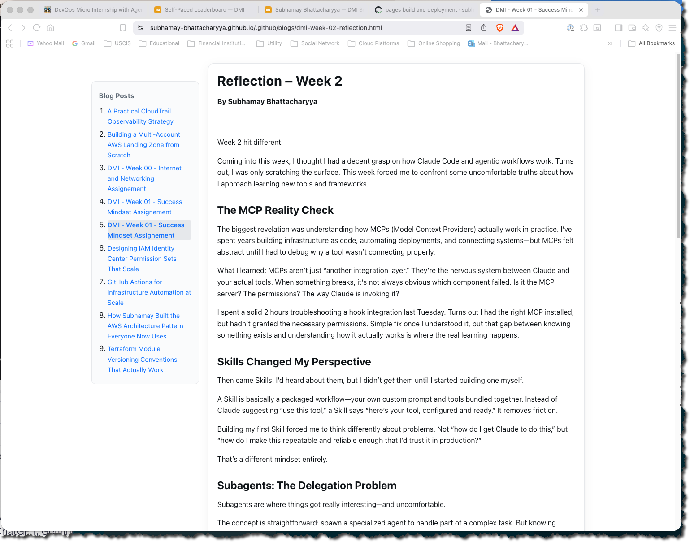
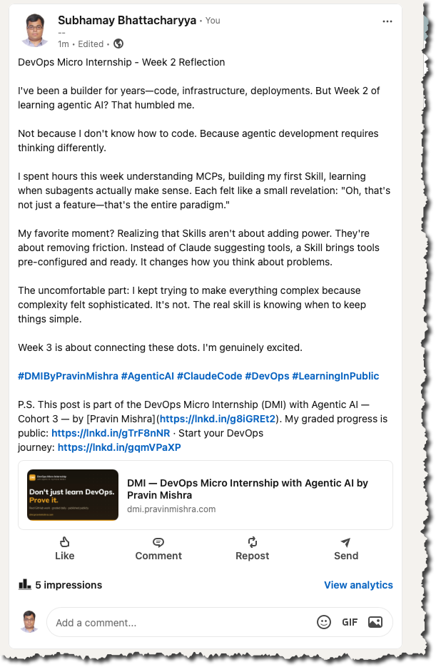

# Assignment 8 — Week 2 Reflection Blog

Part of the DevOps Micro Internship (DMI) Cohort 3 with Agentic AI

---

# Purpose

In this assignment, you will reflect on your Week 2 learning journey and write a short blog capturing your experience working with Agentic AI tools such as Claude Code, Skills, Subagents, MCP, Hooks, Permissions, and Memory.

You will also publish a LinkedIn post summarizing your learning and share both links for evaluation.

---

# Task 1 — Write Your Reflection Blog

## Goal

Write a reflection blog covering your Week 2 learning experience.

### Blog Requirements

Your blog must include:

* Title: **Reflection – Week 2**
* Minimum 300 words
* At least 2–3 topics from Week 2 (Claude Code, Skills, Subagents, MCP, Hooks, Permissions, Memory)
* Honest personal reflection (learning, challenges, mindset)
* One habit/system you plan to implement
* Your full name clearly visible

### Allowed Platforms

You can publish your blog on:

* Hashnode
* Medium
* Dev.to
* LinkedIn Article
* GitHub Markdown file
* Substack

---

### Evidence

#### Screenshot 1 — Blog published and visible

---

### Submission Field

Blog Link:

[Blog Post](https://subhamay-bhattacharyya.github.io/.github/blogs/dmi-week-02-reflection.html)

---

# Task 2 — Create LinkedIn Post

## Goal

Share your Week 2 learning publicly on LinkedIn.

---

### LinkedIn Post Requirements

Your post must include:

* One screenshot from any Week 2 assignment
* Short reflection (what you learned or built)
* Required P.S. line exactly as given below

---

### Required P.S. Line (Must Include Exactly)

> **P.S. This post is part of the DevOps Micro Internship (DMI) with Agentic AI — Cohort 3 — by [Pravin Mishra](https://www.linkedin.com/in/pravin-mishra-aws-trainer/). My graded progress is public: https://dmi.pravinmishra.com/s/YOUR-GITHUB-USERNAME.html · Start your DevOps journey: https://dmi.pravinmishra.com/?utm_source=student&utm_medium=ps-linkedin&utm_campaign=cohort3**

---

### Suggested Hashtags

#DMIByPravinMishra #AgenticAI #ClaudeCode #DevOps #LearningInPublic

---

### Evidence

#### Screenshot 2 — LinkedIn post published

---

### Submission Field

LinkedIn Post Content (copy-paste here):

DevOps Micro Internship - Week 2 Reflection

I've been a builder for years—code, infrastructure, deployments. But Week 2 of learning agentic AI? That humbled me.

Not because I don't know how to code. Because agentic development requires thinking differently.

I spent hours this week understanding MCPs, building my first Skill, learning when subagents actually make sense. Each felt like a small revelation: "Oh, that's not just a feature—that's the entire paradigm."

My favorite moment? Realizing that Skills aren't about adding power. They're about removing friction. Instead of Claude suggesting tools, a Skill brings tools pre-configured and ready. It changes how you think about problems.

The uncomfortable part: I kept trying to make everything complex because complexity felt sophisticated. It's not. The real skill is knowing when to keep things simple.

Week 3 is about connecting these dots. I'm genuinely excited.

#DMIByPravinMishra #AgenticAI #ClaudeCode #DevOps #LearningInPublic

P.S. This post is part of the DevOps Micro Internship (DMI) with Agentic AI — Cohort 3 — by [Pravin Mishra](https://lnkd.in/g8iGREt2). My graded progress is public: https://dmi.pravinmishra.com/s/subhamay-bhattacharyya.html · Start your DevOps journey: https://lnkd.in/gqmVPaXP

---

### LinkedIn Post Link:

[LinkedIn Post](https://www.linkedin.com/posts/subhamay-bhattacharyya-67753329_dmi-devops-micro-internship-with-agentic-share-7492303222162735104-LwkQ/?utm_source=share&utm_medium=member_desktop&rcm=ACoAAAXzlvsBLGMTn7whkbpl6JdhO70ZuveqIQY

---

# Submission Instructions

* Blog must be publicly accessible
* LinkedIn post must be visible (public or unlisted where applicable)
* All required fields must be filled
* Screenshot proofs must be added to GitHub repository
* Do not include sensitive information in blog or post

---

# Completion Checklist

* [x] Blog written with required structure
* [x] Blog includes at least 2–3 Week 2 topics
* [x] Blog is publicly accessible
* [x] LinkedIn post created
* [x] Required P.S. line included
* [x] LinkedIn post content copied in submission field
* [x] Blog link added
* [x] LinkedIn post link added
* [x] Screenshots added to GitHub repo

---

# About DMI & CloudAdvisory

DevOps Micro Internship (DMI) is a project-based DevOps program run by Pravin Mishra (The CloudAdvisory), focused on real-world execution, systems thinking, and agentic AI workflows.

It helps learners build strong DevOps foundations through hands-on experience.

---

# Resources

* 🌐 DMI Official Website: [https://dmi.pravinmishra.com?utm_source=github&utm_medium=readme](https://dmi.pravinmishra.com?utm_source=github&utm_medium=readme)
* 🎓 University: [https://university.pravinmishra.com?utm_source=github&utm_medium=readme](https://university.pravinmishra.com?utm_source=github&utm_medium=readme)
* 💬 Discord Community: [https://discord.pravinmishra.com?utm_source=github&utm_medium=readme](https://discord.pravinmishra.com?utm_source=github&utm_medium=readme)
* 📝 Blog: [https://dmi.pravinmishra.com/blog?utm_source=github&utm_medium=readme](https://dmi.pravinmishra.com/blog?utm_source=github&utm_medium=readme)
* ▶️ YouTube Playlist: [https://www.youtube.com/playlist?list=PLFeSNDtI4Cho](https://www.youtube.com/playlist?list=PLFeSNDtI4Cho)
* 🔗 Pravin Mishra (LinkedIn): [https://www.linkedin.com/in/pravin-mishra-aws-trainer/](https://www.linkedin.com/in/pravin-mishra-aws-trainer/)
* 🏢 CloudAdvisory (LinkedIn): [https://www.linkedin.com/company/thecloudadvisory/](https://www.linkedin.com/company/thecloudadvisory/)
