# Assignment 2 — Deploy a React App on Ubuntu VM Using Nginx

Part of the DevOps Micro Internship (DMI) Cohort 3 with Agentic AI

---

## Purpose

In this assignment, you will deploy a React application on an Ubuntu EC2 instance and serve it using Nginx. You will provision a Linux server, install the required tools, personalize the application with your details, and verify that it is publicly accessible via a browser.

---

# Task 1 — Setup Environment (Node.js & npm)

## Goal

Install Node.js and npm on the Ubuntu VM and verify the installation.

### Evidence

#### Screenshot 1 — Output of `node -v && npm -v` showing installed versions

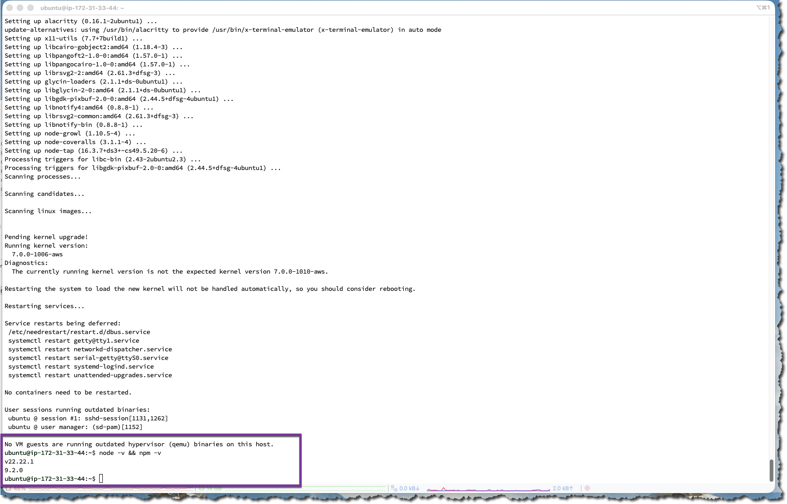

---

# Task 2 — Setup Environment (Nginx)

## Goal

Install Nginx, start the service, and confirm it is running.

### Evidence

#### Screenshot 2 — Output of `systemctl status nginx --no-pager` showing Active (running)

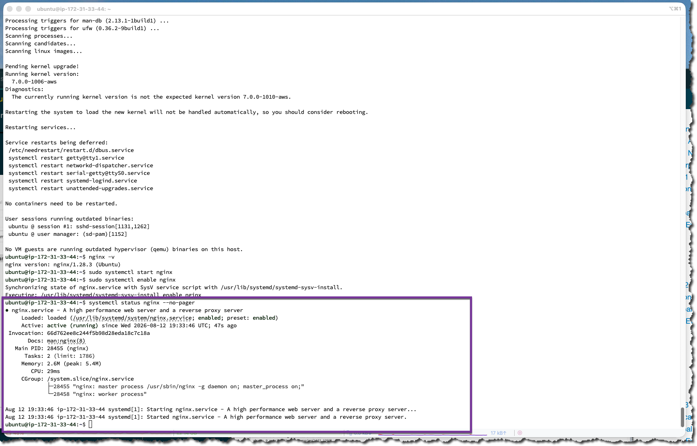

---

# Task 3 — Clone React Application

## Goal

Clone the project repository and verify the project files are present.

### Evidence

#### Screenshot 3 — Output of `ls` inside the `my-react-app` directory showing project files

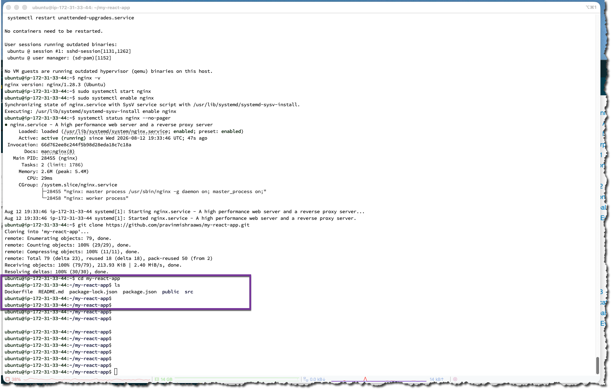

---

# Task 4 — Modify Application (Personalization)

## Goal

Update `App.js` with your full name and the current date.

### Evidence

#### Screenshot 4 — `nano App.js` open showing your full name and date filled in

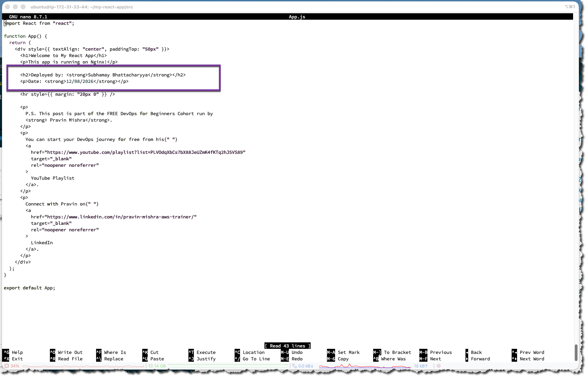

---

# Task 5 — Build React Application

## Goal

Install dependencies and generate the production build.

### Evidence

#### Screenshot 5 — Output of `ls` inside `my-react-app` showing the `build/` folder generated

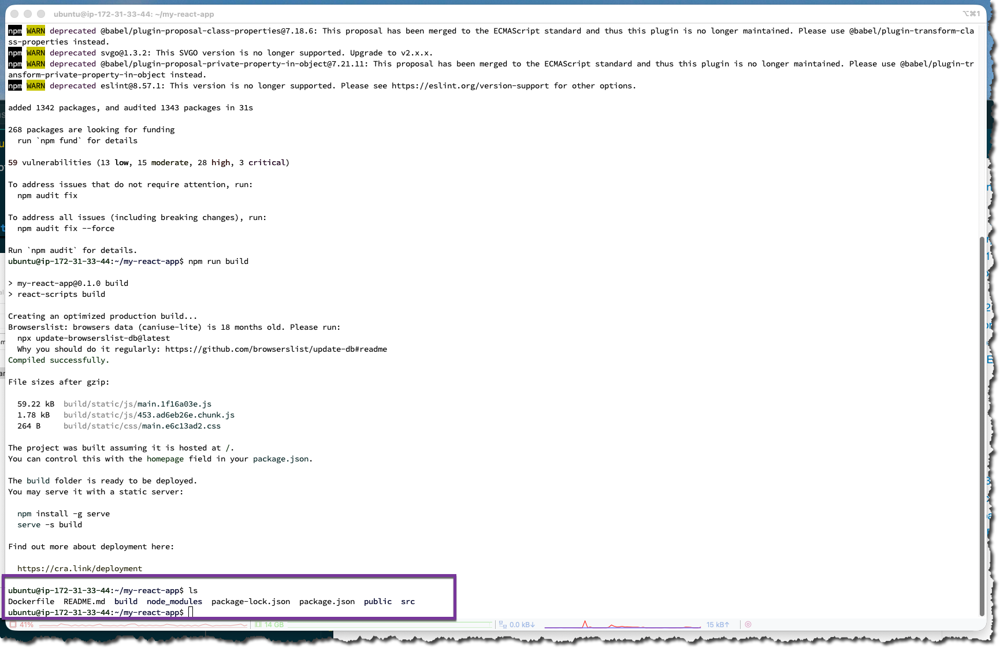

---

# Task 6 — Deploy React Build to Nginx Web Root

## Goal

Copy the production build files to the Nginx web root directory.

### Evidence

#### Screenshot 6 — Output of `ls /var/www/html/` showing the deployed build contents

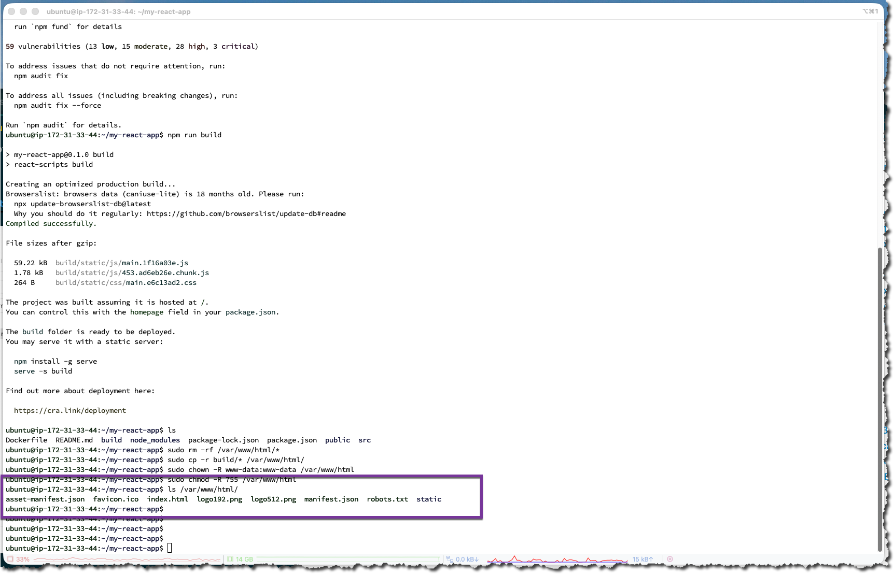

---

# Task 7 — Configure Nginx for React Application

## Goal

Apply Nginx configuration for React routing and confirm the service is active.

### Evidence

#### Screenshot 7 — Output of `systemctl is-active nginx` showing `active`

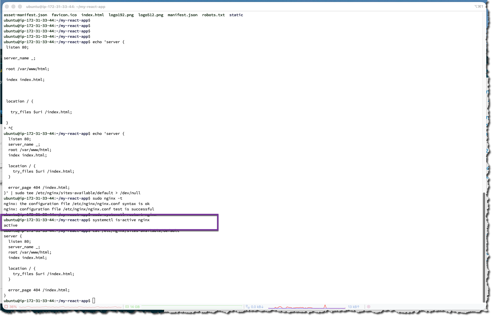

---

#### Screenshot 8 — Output of `cat /etc/nginx/sites-available/default` showing the Nginx config

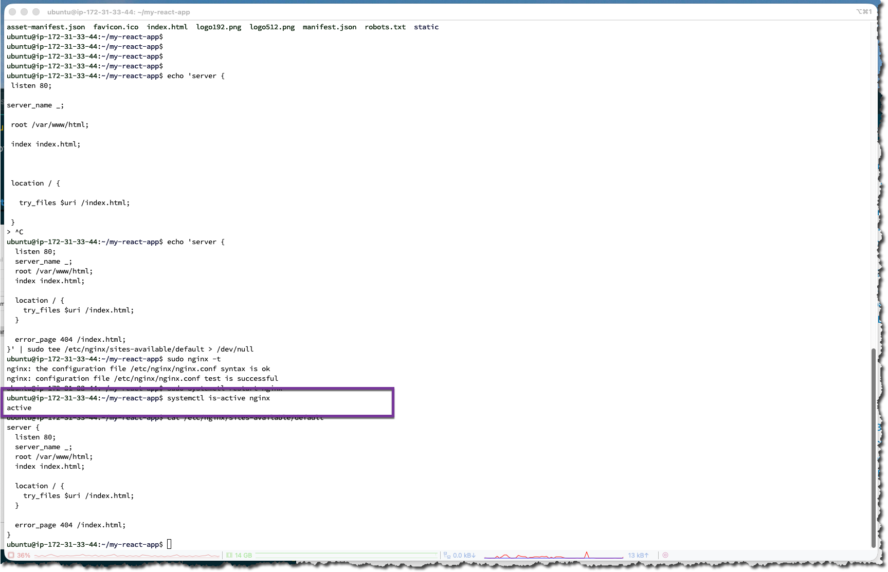

---

# Task 8 — Test Deployment

## Goal

Verify the React application is publicly accessible via the server's public IP.

### Evidence

#### Screenshot 9 — Output of `curl ifconfig.me` showing the server's public IP address

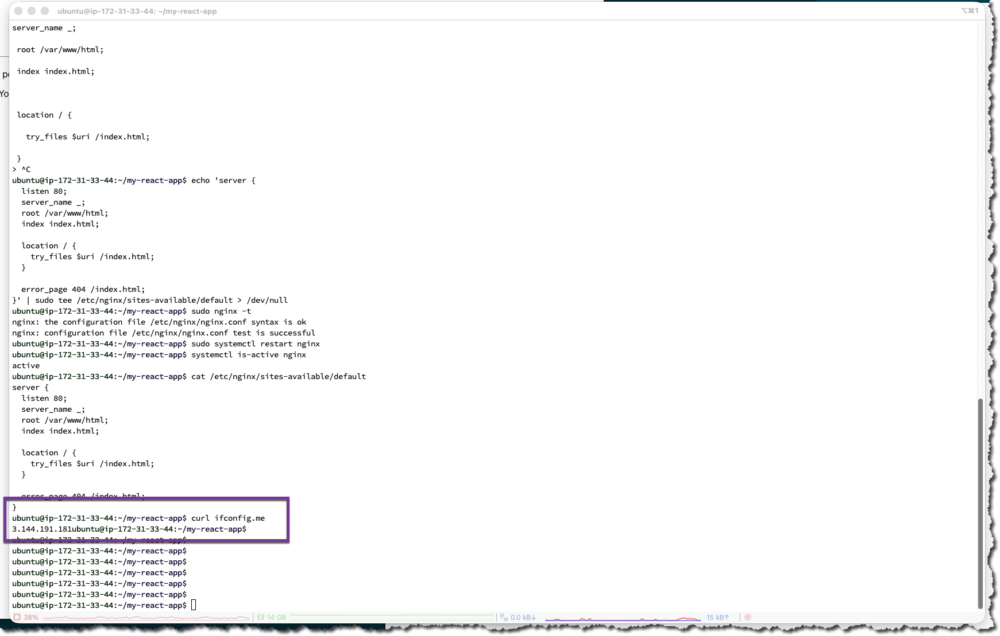

---

#### Screenshot 10 — Browser showing the deployed React app at `http://<public-ip>` with your name and date visible

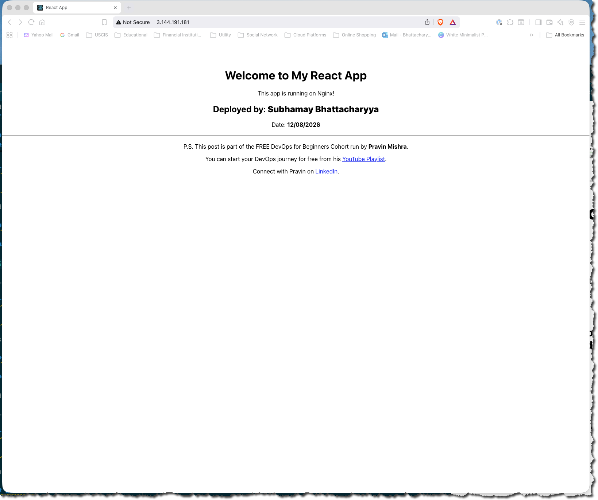

---

# LinkedIn Post (Required)

## Evidence

#### LinkedIn Post URL

Paste your LinkedIn post URL here:

[Linkedin Post](https://www.linkedin.com/posts/subhamay-bhattacharyya-67753329_devops-aws-ubuntu-share-7493396505341452288-vrjF/?utm_source=share&utm_medium=member_desktop&rcm=ACoAAAXzlvsBLGMTn7whkbpl6JdhO70ZuveqIQY)

---

#### Screenshot — LinkedIn post showing the deployed application

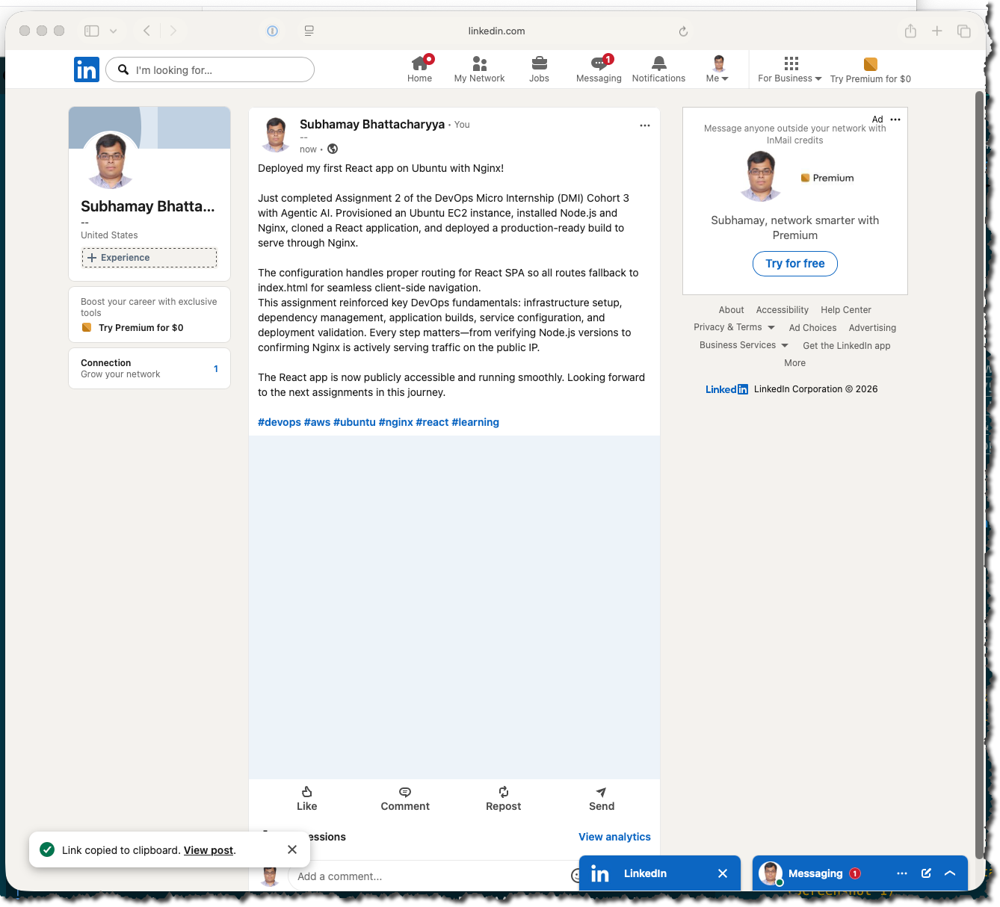

---

# Submission Instructions

- Add all required screenshots in your submission
- Full name must be visible in required screenshots
- Do not expose sensitive information (keys, passwords, account IDs)

---

# Completion Checklist

- [x] Node.js and npm installed and verified (Screenshot 1)
- [x] Nginx installed and running (Screenshot 2)
- [x] Repository cloned and files verified (Screenshot 3)
- [x] App.js updated with full name and date (Screenshot 4)
- [x] Production build generated (Screenshot 5)
- [x] Build files deployed to Nginx web root (Screenshot 6)
- [x] Nginx configured and active (Screenshots 7 & 8)
- [x] Public IP retrieved (Screenshot 9)
- [x] React app accessible in browser with personal details visible (Screenshot 10)
- [x] LinkedIn post published and URL submitted
- [x] No sensitive data exposed

---

## 📌 About DMI & CloudAdvisory

DevOps Micro Internship (DMI) is a project-based DevOps program run by Pravin Mishra (The CloudAdvisory) focused on real-world execution, systems thinking, and career readiness.

It helps learners build strong DevOps foundations with hands-on experience.

---

## 📌 Resources

- 🌐 DMI Official Website: https://dmi.pravinmishra.com?utm_source=github&utm_medium=readme  
- 🎓 University: https://university.pravinmishra.com?utm_source=github&utm_medium=readme  
- 💬 Discord Community: https://discord.pravinmishra.com?utm_source=github&utm_medium=readme  
- 📝 Blog: https://dmi.pravinmishra.com/blog?utm_source=github&utm_medium=readme  
- ▶️ YouTube Playlist: https://www.youtube.com/playlist?list=PLFeSNDtI4Cho  
- 🔗 Pravin Mishra (LinkedIn): https://www.linkedin.com/in/pravin-mishra-aws-trainer/  
- 🏢 CloudAdvisory (LinkedIn): https://www.linkedin.com/company/thecloudadvisory/

---

*This submission is part of DevOps Micro Internship (DMI) Cohort 3 — Agentic AI Track.*