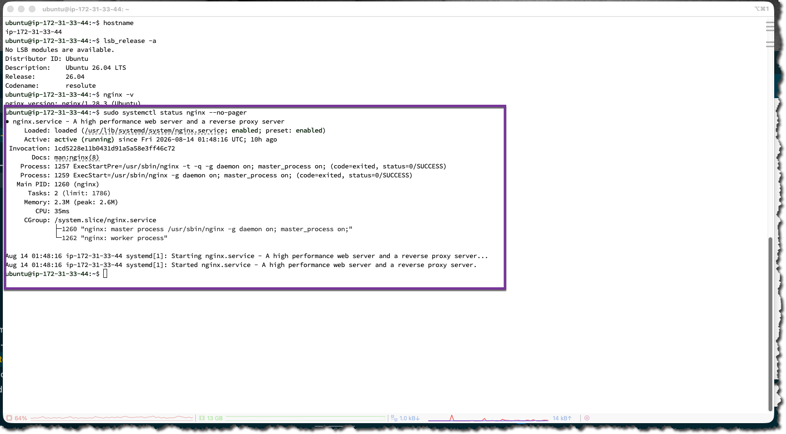
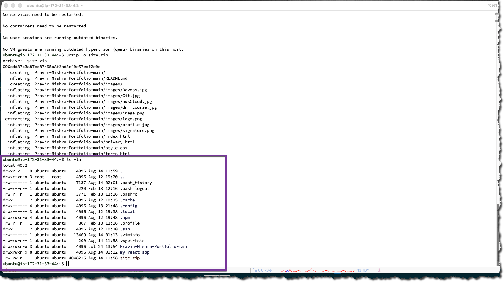
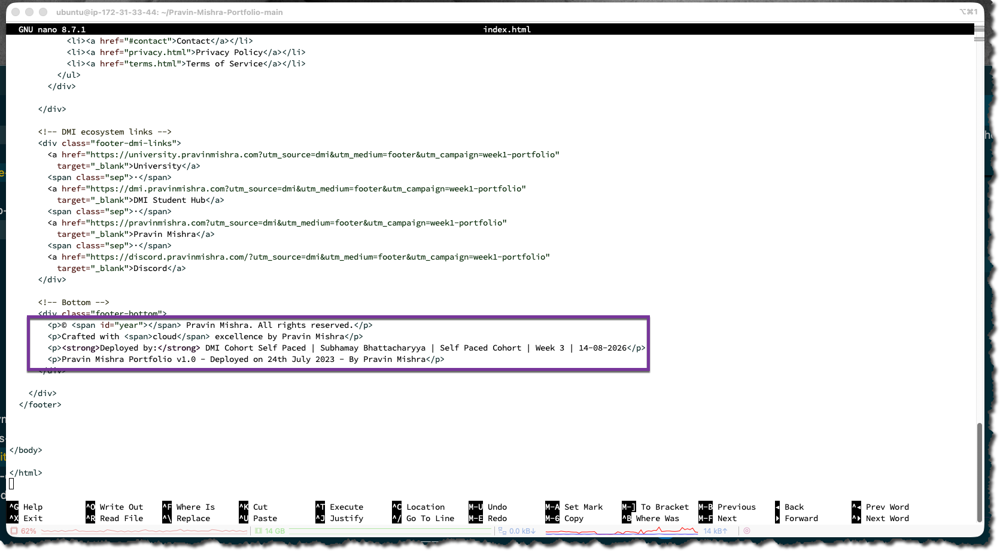
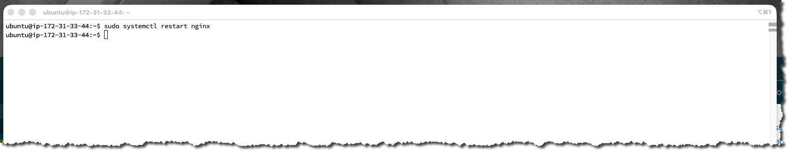
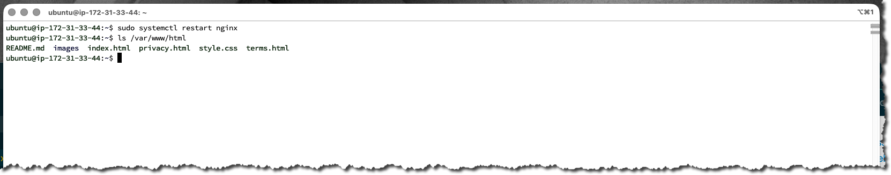
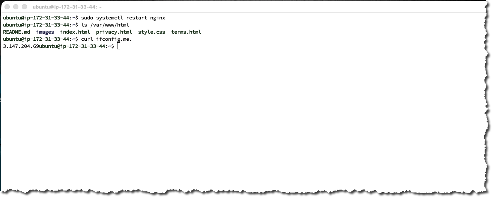
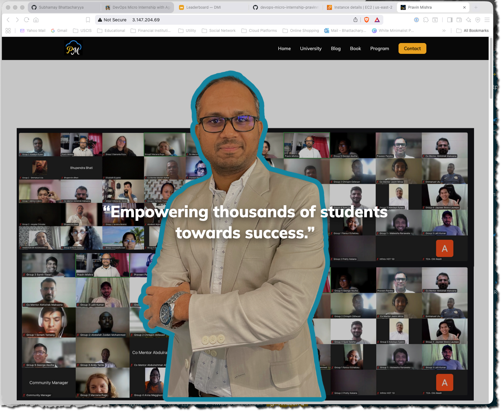
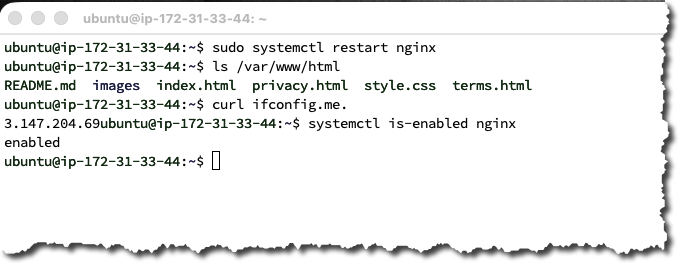
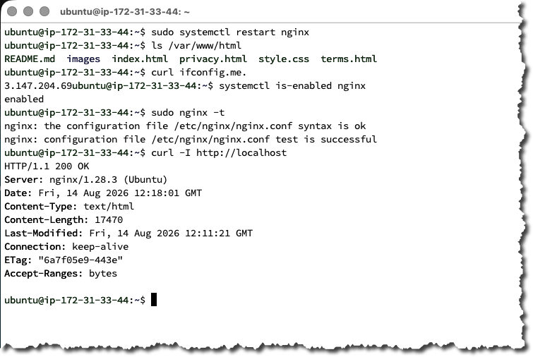
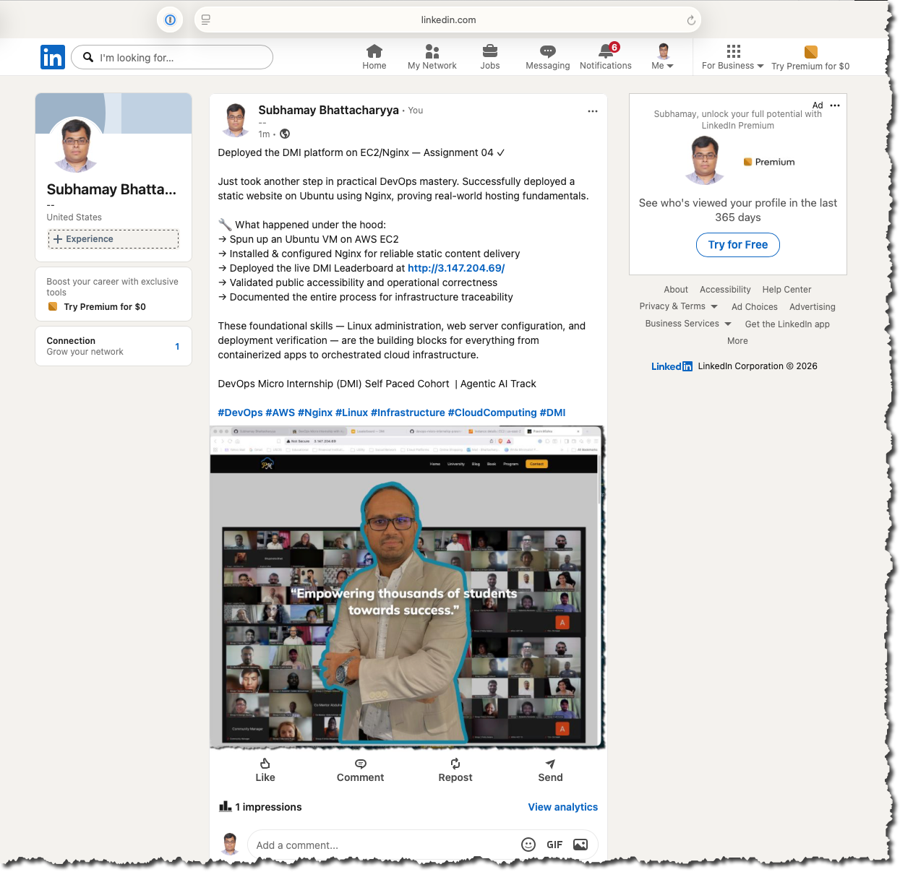

# Assignment 4 — Deploy EpicReads Portfolio Website via Nginx

Part of the DevOps Micro Internship (DMI) Cohort 3 with Agentic AI

---

## Purpose

In this assignment, you will deploy a static portfolio website on an Ubuntu VM using Nginx. You will download the website template, add your ownership proof in the footer, deploy the files to the Nginx web root, and verify the website is publicly accessible via a browser.

---

# Task 0 — Pre-flight Check

## Goal

Verify the Ubuntu VM and Nginx are ready for deployment.

### Evidence

#### Screenshot 0 — Output of `sudo systemctl status nginx --no-pager` showing Active (running)

---

# Task 1 — Get the Website Source Code

## Goal

Download and extract the portfolio website template.

### Evidence

#### Screenshot 1 — Output of `ls -la` showing the extracted project folder

---

# Task 2 — Add Ownership Proof (Anti-Copy Change)

## Goal

Update the website footer with your deployment details.

### Evidence

#### Screenshot 2 — Nano editor open with the updated footer showing your Full Name, Group, Week, and Date

---

# Task 3 — Deploy Website via Nginx

## Goal

Deploy the portfolio website to the Nginx web root.

### Evidence

#### Screenshot 3 — Output of `sudo nginx -t` showing configuration test successful

---

#### Screenshot 4 — Output of `ls /var/www/html` showing deployed website files

---

# Task 4 — Verify Website is Live

## Goal

Verify the deployed website is publicly accessible and the footer contains your details.

### Evidence

#### Screenshot 5 — Output of `curl ifconfig.me` showing the server's public IP address

---

#### Screenshot 6 — Browser showing the live website with your Full Name and deployment details in the footer

---

# Task 5 — Mini Real DevOps Operational Check

## Goal

Verify the deployed website and Nginx service are healthy.

### Evidence

#### Screenshot 7 — Output of `systemctl is-enabled nginx`

---

#### Screenshot 8 — Output of `curl -I http://localhost` showing 200 OK

---

# LinkedIn Post (Mandatory)

## Evidence

#### LinkedIn Post URL

Paste your LinkedIn post URL here:

[LinkedIn Post](https://www.linkedin.com/posts/subhamay-bhattacharyya-67753329_devops-aws-nginx-share-7494005939533156352-58dC/?utm_source=share&utm_medium=member_desktop&rcm=ACoAAAXzlvsBLGMTn7whkbpl6JdhO70ZuveqIQY)

---

#### Screenshot — Published LinkedIn post showing the live website with your Full Name in the footer

---

# Submission Instructions

- Add all required screenshots in your submission
- Full name must be visible in required screenshots
- Ownership proof in the footer is mandatory
- Do not expose sensitive information (keys, passwords, account IDs)

---

# Completion Checklist

- [x] Screenshot 0: Nginx service status (active/running)
- [x] Screenshot 1: Website files downloaded and extracted
- [x] Screenshot 2: Footer updated with Full Name, Group, Week, and Date
- [x] Screenshot 3: Nginx configuration test successful
- [x] Screenshot 4: Website files deployed to /var/www/html
- [x] Screenshot 5: Public IP retrieved
- [x] Screenshot 6: Live website accessible in browser with footer details
- [x] Screenshot 7: Nginx enabled on boot
- [x] Screenshot 8: Local HTTP response returns 200 OK
- [x] LinkedIn post published and URL submitted
- [x] Full Name visible in all required screenshots
- [x] No sensitive data exposed

---

## 📌 About DMI & CloudAdvisory

DevOps Micro Internship (DMI) is a project-based DevOps program run by Pravin Mishra (The CloudAdvisory) focused on real-world execution, systems thinking, and career readiness.

It helps learners build strong DevOps foundations with hands-on experience.

---

## 📌 Resources

- 🌐 DMI Official Website: https://dmi.pravinmishra.com?utm_source=github&utm_medium=readme  
- 🎓 University: https://university.pravinmishra.com?utm_source=github&utm_medium=readme  
- 💬 Discord Community: https://discord.pravinmishra.com?utm_source=github&utm_medium=readme  
- 📝 Blog: https://dmi.pravinmishra.com/blog?utm_source=github&utm_medium=readme  
- ▶️ YouTube Playlist: https://www.youtube.com/playlist?list=PLFeSNDtI4Cho  
- 🔗 Pravin Mishra (LinkedIn): https://www.linkedin.com/in/pravin-mishra-aws-trainer/  
- 🏢 CloudAdvisory (LinkedIn): https://www.linkedin.com/company/thecloudadvisory/

---

*This submission is part of DevOps Micro Internship (DMI) Cohort 3 — Agentic AI Track.*