# Assignment 5 — Bash Script Automation Drill (OPS Checklist)

Part of the DevOps Micro Internship (DMI) Cohort 3 with Agentic AI

---

## Purpose

In this assignment, we will practice Bash scripting by building a series of small automation scripts covering environment setup, variables, arrays, loops, file conditionals, if-else logic, and functions. These scripts form the foundation of real-world Linux automation used in DevOps, cloud, and production support environments.

---

# Task 1 — Bash Environment & Workspace Setup

## Goal

Verify that Bash is available on your system and create a clean workspace for this assignment.

### Evidence

#### Screenshot 1 — Output of `echo $SHELL` and `bash --version`

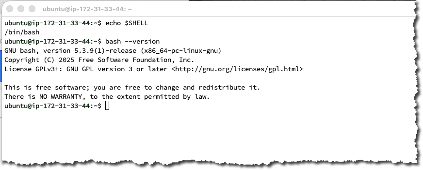

---

#### Screenshot 2 — Output of `pwd` and `ls -lah` showing the scripts directory

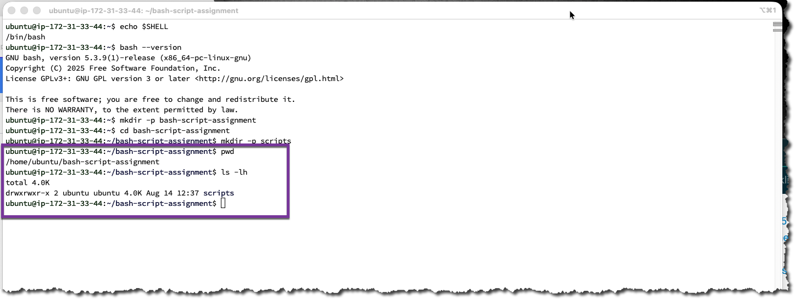

---

### Notes

Ansyour the following in your own words:

**1. What is Bash?**

Bash (Bourne Again Shell) is a command-line interpreter and scripting language used to interact with the operating system. It reads commands entered at the terminal or from script files, interprets them, and executes them through the kernel. Bash allows users to run programs, manage files, automate tasks through scripts, and perform system administration. It's the default shell on most Linux distributions and macOS, making it fundamental for DevOps engineers and system administrators who need to automate infrastructure tasks and manage cloud environments.

---

**2. What is the difference between shell and Bash?**

A shell is a generic umbrella term for any command interpreter that provides a user interface to the operating system. There are many types of shells, including sh (Bourne Shell), csh (C Shell), ksh (Korn Shell), zsh, and fish. Bash is a specific implementation — it stands for Bourne Again Shell and is an enhanced version of the original Bourne Shell (sh). Bash includes advanced features that older shells don't have, such as command history, tab completion, arrays, associative arrays, and better string manipulation. While Bash is a shell, not every shell is Bash. Understanding this distinction is important because scripts written in Bash syntax may not work in other shells, and portability across different systems depends on knowing which shell features we're using.

---

**3. Why is it important to confirm the Bash version before writing scripts?**

Different versions of Bash support different features and syntax. Bash 4.x and later versions introduced features like associative arrays, extended globbing, and improved variable expansion that don't exist in Bash 3.x. If we write a script using Bash 4.x features and run it on a system with Bash 3.x (common on macOS and older Linux systems), the script will fail or produce errors. In DevOps and infrastructure automation, scripts need to run reliably across multiple servers and environments. By confirming the Bash version available on your target systems, we can either adjust your script to use compatible syntax or add version checks to handle different environments. This ensures your automation code is reproducible, predictable, and won't break unexpectedly in production.

---

# Task 2 — your First Bash Script

## Goal

Create your first Bash script, make it executable, and run it from the terminal.

### Evidence

#### Screenshot 1 — Content of `first-script.sh`

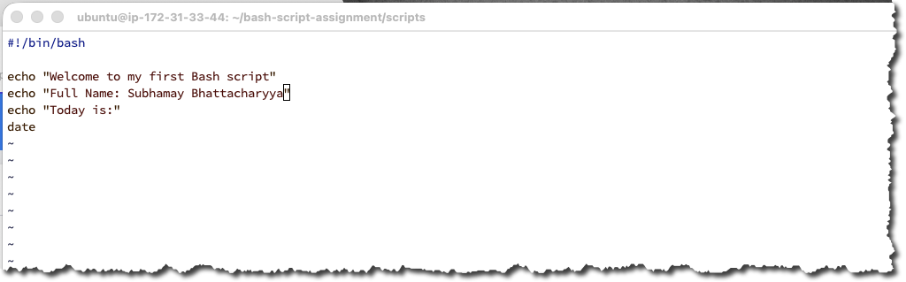

---

#### Screenshot 2 — Output of `./first-script.sh`

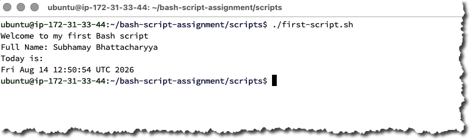

---

#### Screenshot 3 — Output of `ls -l first-script.sh` showing executable permission

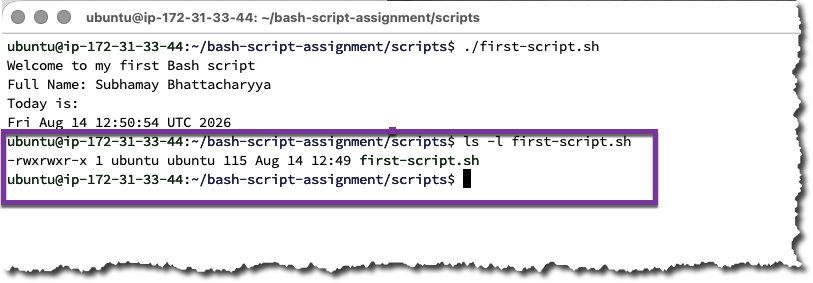

---

### Notes

Ansyour the following in your own words:

**1. What is the purpose of `#!/bin/bash`?**

The `#!/bin/bash` line is called a shebang (or hashbang). It's placed at the very beginning of a script file and tells the operating system which interpreter should execute the script. When we run a script as an executable (using `./script.sh`), the system reads this first line and knows to use the Bash interpreter located at `/bin/bash` to run the commands in the file. Without this shebang line, the system won't know which interpreter to use and the script will likely fail. This is especially important in DevOps automation where scripts may run on different systems or be called from various contexts.

---

**2. Why do we use `chmod +x` before running a script?**

`chmod +x` adds execute permissions to a script file, marking it as executable. By default, files we create on Linux don't have execute permissions — they're readable and writable but not runnable. When we run a script using `./script.sh`, the system needs execute permission to treat the file as a program and invoke the interpreter specified in the shebang line. Without `chmod +x`, we'll get a "Permission denied" error even if the script is syntactically correct. In DevOps workflows, this is a critical step when deploying automation scripts to servers or CI/CD pipelines — we must ensure the scripts have proper execute permissions before they can run.

---

**3. What is the difference between running a script using `./script.sh` and `bash script.sh`?**

When we run `./script.sh`, we're executing the script as an executable file. The system reads the shebang line (`#!/bin/bash`) to determine which interpreter to use, then runs the script with that interpreter. This requires the file to have execute permissions (set via `chmod +x`). When we we `bash script.sh`, we're explicitly calling the Bash interpreter and telling it to execute the script as an argument. In this case, the shebang line is ignored because we're explicitly specifying the interpreter. Both methods work, but `./script.sh` is preferred in production and automation environments because it makes the script portable — if we change the shebang to use a different interpreter (like `#!/bin/sh`), the behavior changes automatically without modifying how the script is called.

---

# Task 3 — Variables: User Information Script

## Goal

Use variables to store and display user-related information.

### Evidence

#### Screenshot 1 — Content of `user-info.sh`

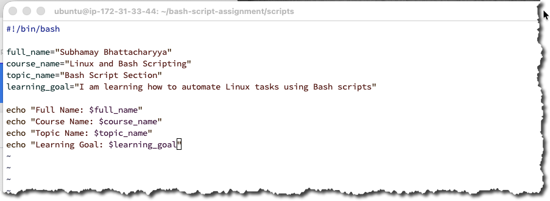

---

#### Screenshot 2 — Output of `./user-info.sh`

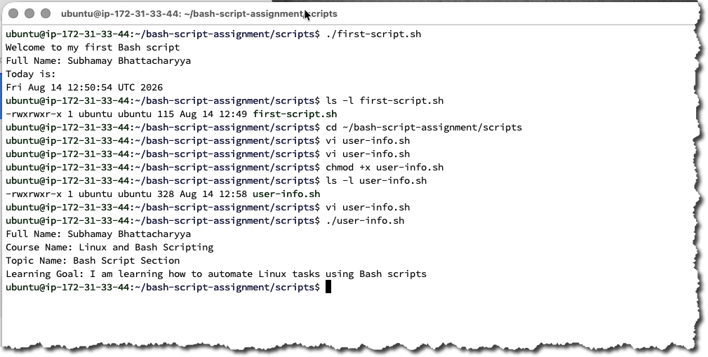

---

### Notes

Ansyour the following in your own words:

**1. What is a variable in Bash?**

A variable in Bash is a named container that stores data or values. It holds information like strings, numbers, file paths, or command outputs that can be used and referenced throughout a script. Variables allow us to store data once and reuse it multiple times, making scripts flexible and easier to maintain. For example, we might store a server name, configuration value, or the result of a command in a variable and then use that variable in different parts of your script. In DevOps automation, variables are essential for parameterizing scripts so they can work across different environments without hardcoding values.

---

**2. Why should we avoid spaces around the `=` sign when creating variables?**

In Bash, spaces around the `=` sign have special meaning and cause syntax errors. When we write `name = value`, Bash interprets this differently than `name=value`. Without spaces, Bash recognizes it as a variable assignment. With spaces, Bash treats `name` as a command to execute, and `=` and `value` as separate arguments, resulting in a "command not found" error. The strict syntax `variable_name=value` with no spaces is required for Bash variable assignment. This is a common mistake when learning Bash scripting, but following this rule precisely ensures your scripts run correctly and prevents unexpected failures in automated deployments.

---

**3. How do we access the value stored inside a Bash variable?**

To access the value stored in a Bash variable, we prefix the variable name with a dollar sign (`$`). For example, if we create a variable `name=Subhamay`, we access its value by using `$name`. we can use this in commands like `echo $name` to print the value, or pass it to other programs like `echo "Hello, $name"`. we can also use braces for clarity and to avoid ambiguity: `${name}` is equivalent to `$name`. This syntax tells Bash to substitute the variable's value at that position in the command. In scripts, this allows we to use stored values dynamically — essential for building flexible automation that works across different servers and configurations.

---

# Task 4 — Arrays & Loops: Tools Checklist Script

## Goal

Use arrays and loops to print a checklist of tools used in Bash scripting.

### Evidence

#### Screenshot 1 — Content of `tools-checklist.sh`

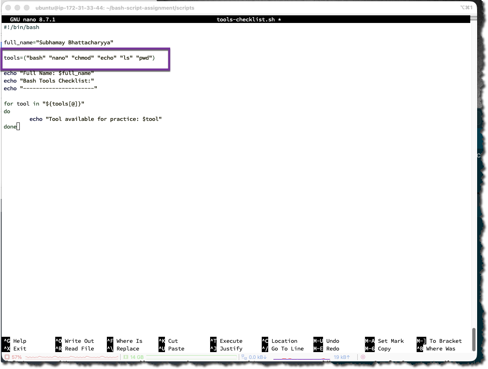

---

#### Screenshot 2 — Output of `./tools-checklist.sh`

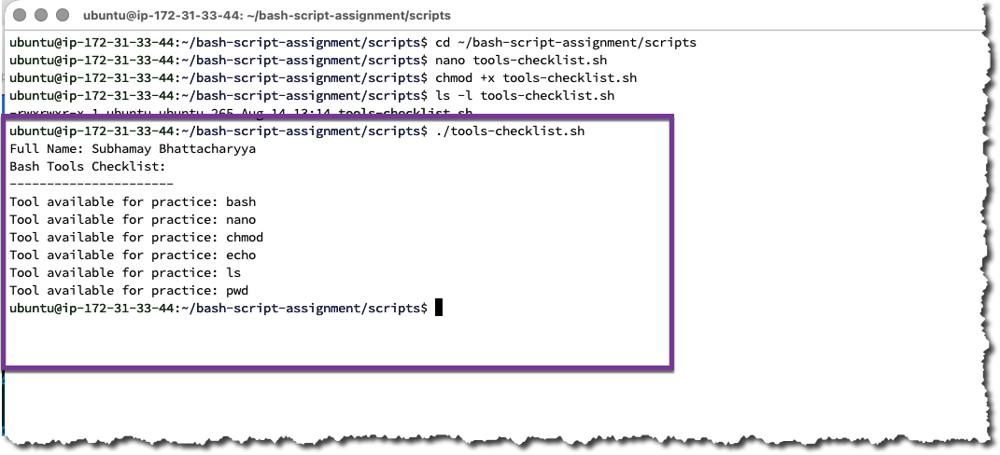

---

### Notes

Ansyour the following in your own words:

**1. What is an array in Bash?**

An array in Bash is a variable that stores multiple values or elements under a single name. Instead of creating separate variables for each item, you can group related data together in an array. For example, you can create an array called `tools` that contains multiple tool names like Terraform, Docker, and Kubernetes. Each element in the array can be accessed by its index (starting from 0). Arrays are fundamental in Bash scripting for managing collections of data, such as lists of servers, configuration files, or automation tasks. In DevOps, arrays are commonly used to store multiple environment names, AWS regions, or service names that need to be processed in bulk.

---

**2. Why are arrays useful in scripts?**

Arrays are useful because they allow you to store and manage multiple related values in a single variable, avoiding the need to create many individual variables. This makes scripts cleaner and more maintainable. Arrays enable you to iterate through collections of data using loops, applying the same operations to each element without repetition. For example, instead of hardcoding server names individually, you can store them in an array and loop through each one to perform deployments or checks. In DevOps automation, arrays save time and reduce errors by allowing you to process multiple resources (servers, environments, file paths) systematically. They also make scripts more scalable — you can easily add or remove items from an array without rewriting the logic.

---

**3. What does `"${tools[@]}"` mean?**

`"${tools[@]}"` expands all elements of the `tools` array. The `@` symbol means "all elements," so this syntax retrieves every value stored in the array. The curly braces `{}` provide clarity and prevent ambiguity with surrounding text, and the double quotes `""` preserve spacing and special characters within each element. For example, if `tools=(Terraform Docker Kubernetes)`, then `"${tools[@]}"` expands to `Terraform Docker Kubernetes`. This syntax is commonly used in loops or when passing array elements to commands. Without the quotes, word splitting could cause issues; with quotes, each element is preserved correctly, which is critical for handling file paths or values with spaces in DevOps scripts.

---

**4. What is the purpose of the `for` loop in this script?**

The `for` loop iterates through each element in an array one at a time, allowing you to perform the same action on every item. In a typical DevOps script, a `for` loop might iterate through an array of servers and run a deployment command on each one, or loop through an array of environments and apply configuration to each. The loop automatically extracts each element from the array and assigns it to a loop variable (commonly `tool` or `server`) that you can use in the loop body. Using a `for` loop eliminates the need to manually write the same command multiple times — instead, you write it once and let the loop execute it for every element. This is essential for automation at scale in DevOps, where you need to apply operations consistently across dozens or hundreds of resources.

---

# Task 5 — Loops: Number Counter Script

## Goal

Use loops to repeat a task multiple times.

### Evidence

#### Screenshot 1 — Content of `counter.sh`

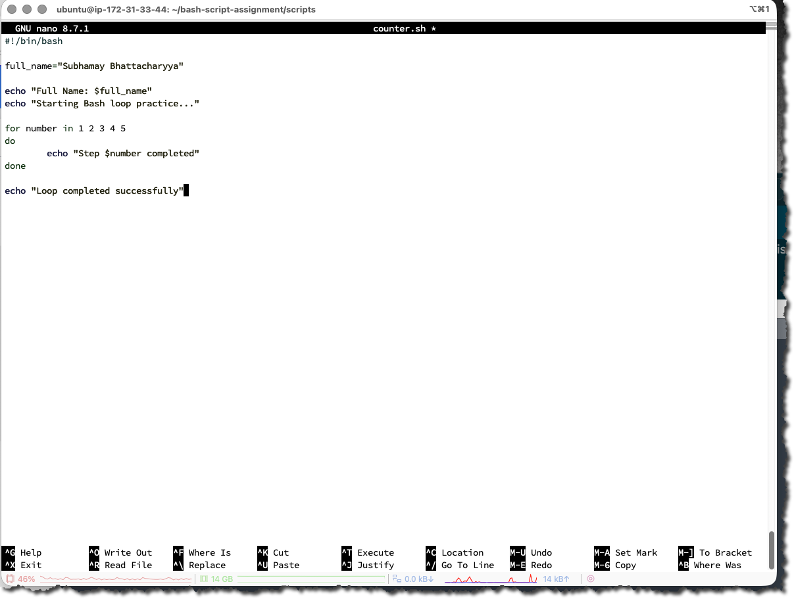

---

#### Screenshot 2 — Output of `./counter.sh`

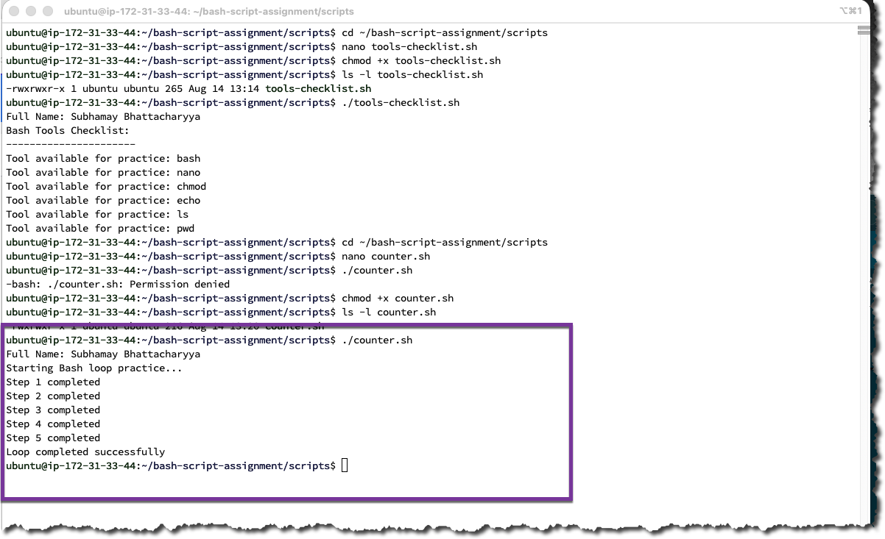

---

### Notes

Ansyour the following in your own words:

**1. What is a loop?**

A loop is a programming construct that repeats a block of code multiple times. Instead of writing the same commands over and over, you write them once inside a loop, and the loop automatically executes that code a specified number of times or until a certain condition is met. Loops are one of the fundamental building blocks of automation because they eliminate repetition and reduce errors. In Bash, there are different types of loops like `for` loops (iterate a fixed number of times or through a list), `while` loops (repeat while a condition is true), and `until` loops (repeat until a condition becomes true). In DevOps scripting, loops allow you to efficiently manage multiple servers, configurations, or tasks without writing redundant code.

---

**2. Why do we use loops in Bash scripting?**

Loops are essential in Bash scripting because they automate repetitive tasks. Without loops, if you needed to process 100 servers, you'd have to write the same command 100 times. With a loop, you write the command once and it automatically executes for each server. Loops save time, reduce code duplication, and minimize human error. They make scripts more maintainable — if you need to change how each item is processed, you only modify the code in one place. In DevOps and infrastructure automation, loops are critical for scaling operations. They allow you to deploy applications across multiple environments, run health checks on dozens of services, or apply security patches to an entire fleet of servers efficiently and consistently.

---

**3. How many times did the loop run in your script?**

The number of times a loop runs depends on the specific loop implementation in your script. A `for` loop that iterates through an array runs once for each element in that array. For example, `for i in {1..5}` runs 5 times (from 1 to 5). A `for` loop that processes an array like `for tool in "${tools[@]}"` runs once for each tool in the array. A `while` loop runs until its condition becomes false, so the number of iterations depends on how the condition changes. Without seeing your specific script, the number of iterations varies based on your loop syntax and data.

---

**4. What would we change if we wanted the loop to run 10 times?**

The changes depend on your loop type. For a range-based `for` loop, you would change `for i in {1..5}` to `for i in {1..10}` to run 10 times. For a loop iterating through an array, you would add more elements to the array so it has 10 items. For a `while` loop, you might change the condition or use a counter variable that increments and stops at 10, like `count=0; while [ $count -lt 10 ]; do ... ((count++)); done`. For an `until` loop, you'd adjust the condition similarly. The key principle is that you modify either the range, the size of the collection being iterated, or the loop condition to control how many times the code executes. In DevOps scripts, this flexibility allows you to scale automation to handle any number of resources.

---

# Task 6 — Files & Conditionals: File Validation Script

## Goal

Use file checks and conditionals to verify whether files and directories exist.

### Evidence

#### Screenshot 1 — Output of `ls -lah ../test-folder`

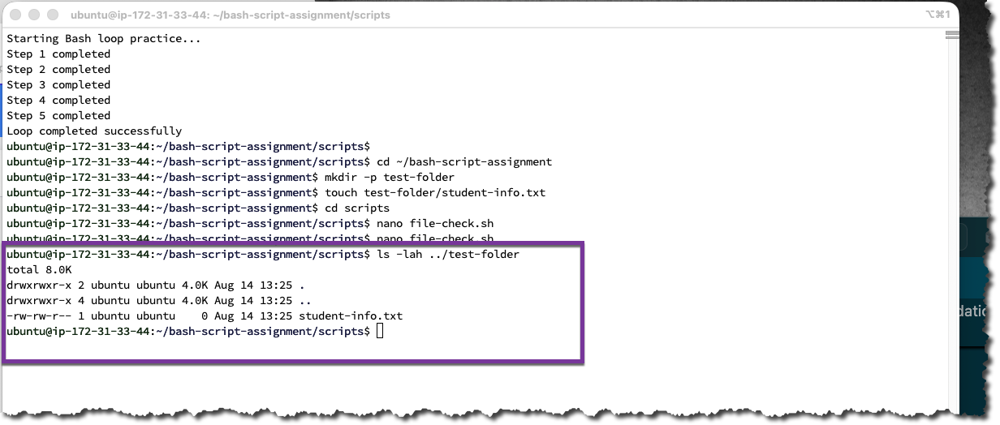

---

#### Screenshot 2 — Content of `file-check.sh`

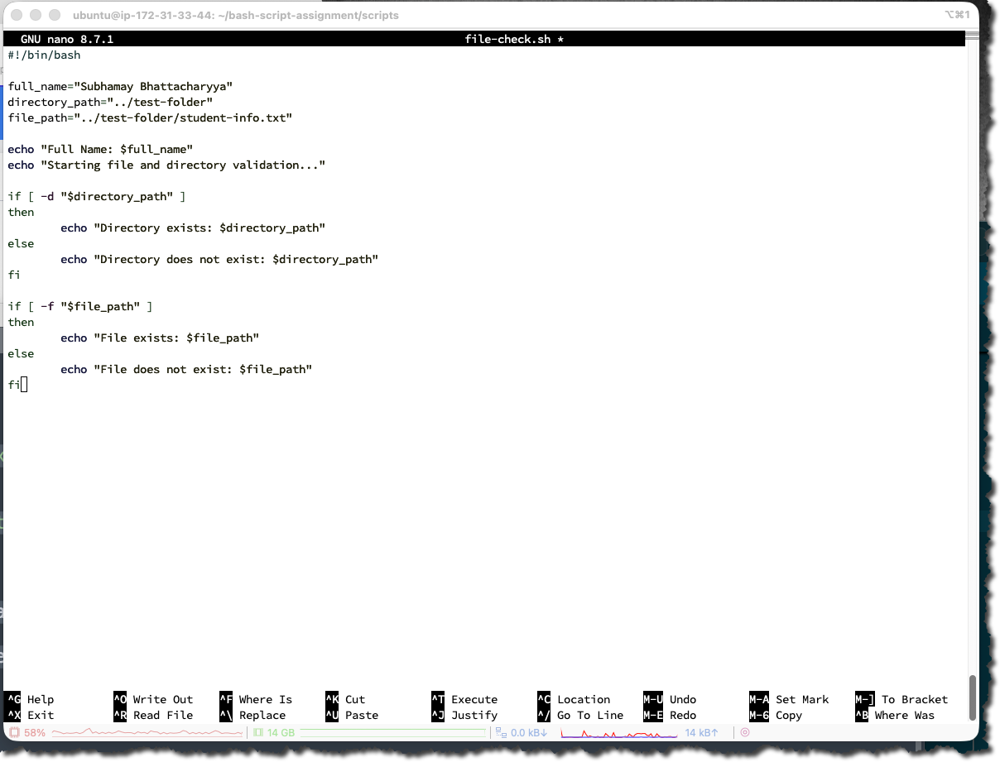

---

#### Screenshot 3 — Output of `./file-check.sh`

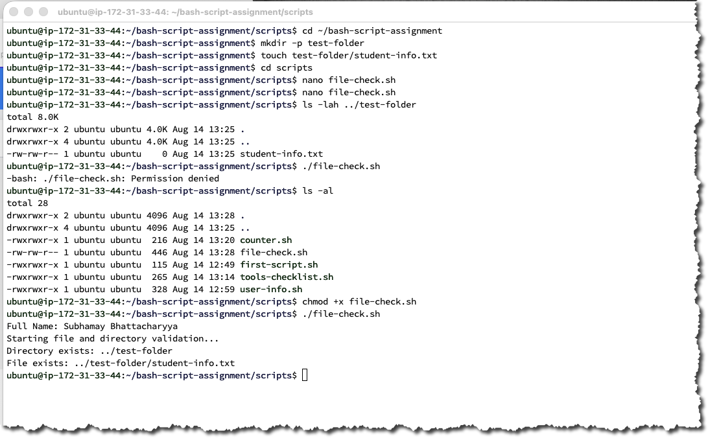

---

### Notes

Ansyour the following in your own words:

**1. What does `-d` check in Bash?**

The `-d` operator tests whether a path is a directory. It's a conditional test in Bash that returns true if the specified path exists and is a directory, and false otherwise. For example, `if [ -d "/var/log" ]` checks whether `/var/log` is a directory. This is useful in scripts when you need to verify that a directory exists before trying to write files to it or navigate into it. In DevOps automation, you might use `-d` to check if backup directories, log directories, or configuration directories exist before performing operations on them. This prevents errors and ensures your script behaves correctly regardless of the system state.

---

**2. What does `-f` check in Bash?**

The `-f` operator tests whether a path is a regular file. It returns true if the specified path exists and is a file (not a directory or special file), and false otherwise. For example, `if [ -f "/etc/config.yaml" ]` checks whether `/etc/config.yaml` is a regular file. This is essential in scripts when you need to verify that a configuration file, deployment script, or data file exists before trying to read or process it. In DevOps workflows, `-f` is commonly used to check for the existence of deployment artifacts, configuration files, or secrets before using them, preventing runtime errors and ensuring reliable automation.

---

**3. Why should file and directory paths be stored in variables?**

Storing file and directory paths in variables makes scripts more flexible, maintainable, and less error-prone. If you hardcode paths throughout your script, changing a path requires editing multiple locations, increasing the risk of mistakes. By storing a path in a variable once, you can reuse it throughout the script by referencing the variable, making changes easier and reducing duplication. Variables also allow scripts to be parameterized — you can set different paths for different environments (development, staging, production) without modifying the script logic. In DevOps, this practice is essential for creating reusable, portable scripts that work across different systems and configurations. It also makes scripts more readable and maintainable for teams working on the same automation code.

---

**4. What happens if the file does not exist?**

If a file does not exist, the `-f` test returns false, and the `if` statement executes the code in the `else` block (if one exists). For example, in `if [ -f "$config_file" ]; then ... else echo "File not found"; fi`, if the file doesn't exist, the script will print "File not found" instead of trying to process the missing file. If there's no `else` block, the script simply skips the code in the `if` block and continues with the rest of the script. Without proper file existence checks, the script might crash or produce errors when trying to read or process a non-existent file. In DevOps automation, checking for file existence is a best practice — it prevents failures, provides clear error messages, and allows the script to handle missing files gracefully by taking alternative actions or alerting the operator.

---

# Task 7 — Conditionals: Pass or Retry Script

## Goal

Use if-else conditionals to make decisions based on a variable value.

### Evidence

#### Screenshot 1 — Content of `score-check.sh` with `score=85`

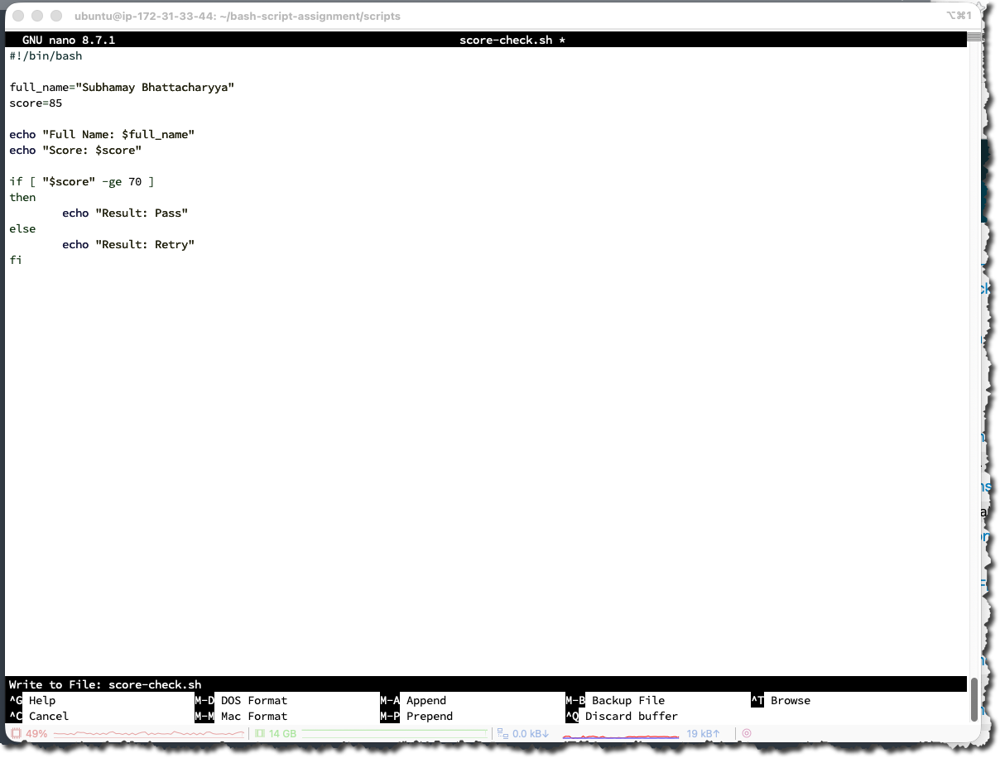

---

#### Screenshot 2 — Output showing `Result: Pass`

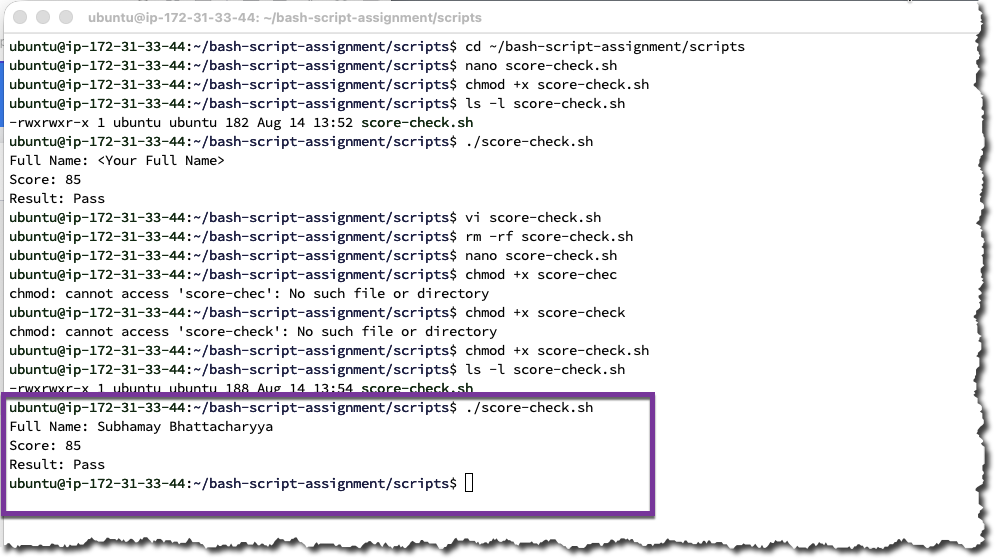

---

#### Screenshot 3 — Content of `score-check.sh` with `score=55`

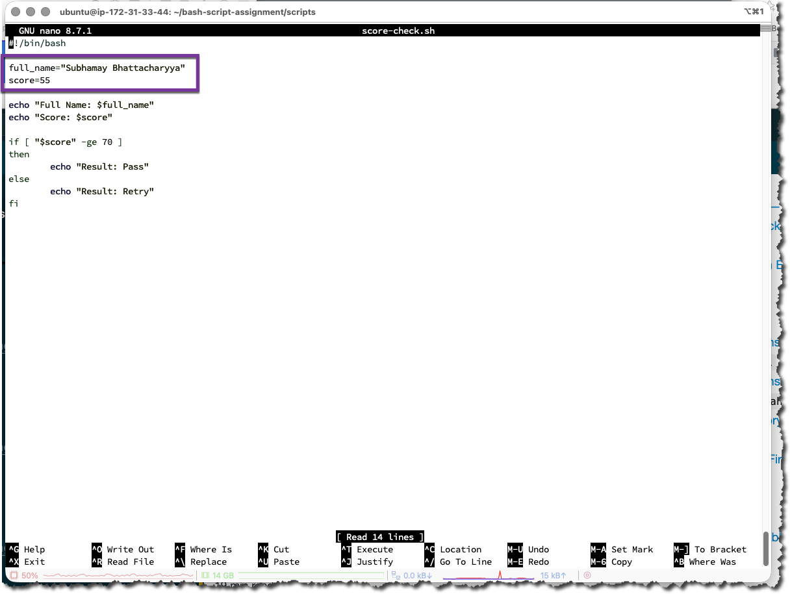

---

#### Screenshot 4 — Output showing `Result: Retry`

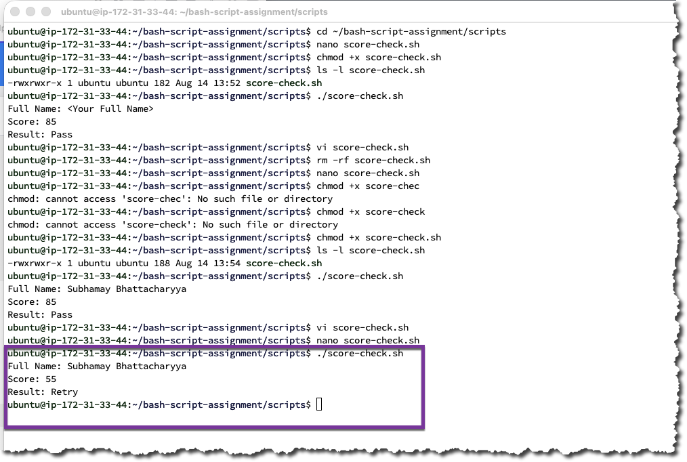

---

### Notes

Ansyour the following in your own words:

**1. What is the purpose of if-else in Bash?**

The `if-else` statement allows scripts to make decisions based on conditions. It evaluates a test or condition and executes different code depending on whether the condition is true or false. The `if` block runs if the condition is true, and the optional `else` block runs if the condition is false. This enables branching logic — the script can take different paths based on the current state. For example, an `if-else` can check whether a file exists and proceed accordingly, or test if a value is within an acceptable range before proceeding. In DevOps automation, `if-else` statements are fundamental for error handling, validation, and decision-making. They allow scripts to respond intelligently to different situations, like checking if a deployment succeeded before moving to the next step, or verifying that required tools are installed before running a process.

---

**2. What does `-ge` mean?**

The `-ge` operator means "greater than or equal to." It's a numerical comparison operator used in Bash conditionals to test whether one number is greater than or equal to another. For example, `if [ $count -ge 5 ]` checks whether the value in `$count` is greater than or equal to 5. Other comparison operators include `-lt` (less than), `-le` (less than or equal to), `-eq` (equal to), `-ne` (not equal to), and `-gt` (greater than). These operators are essential for numeric comparisons in conditional statements. In DevOps scripts, you might use `-ge` to check if a resource count meets minimum requirements, if a response time is below a threshold, or if a version number is sufficient before proceeding with an operation.

---

**3. Why should conditions be tested with different values?**

Testing conditions with different values is crucial for validating that your script behaves correctly in all scenarios. Different input values expose edge cases and potential bugs that might not be apparent from a single test. For example, testing a condition with values at the boundary (like testing `-ge 5` with values 4, 5, and 6) ensures the comparison operator works correctly. Testing with valid and invalid values confirms that your error handling is effective. In DevOps automation, thorough testing prevents production failures. You should test your scripts with various inputs — different file paths, different environment variables, different user inputs, and various system states. This ensures your automation works reliably across all environments and handles unexpected situations gracefully without crashing or producing incorrect results.

---

**4. How can conditionals help in automation scripts?**

Conditionals enable scripts to respond dynamically to different situations, making automation intelligent and resilient. They allow scripts to validate input, check for prerequisites, handle errors, and adjust behavior based on system state. For example, a deployment script might use conditionals to check if a database connection succeeds before deploying code, or verify that required configuration files exist before proceeding. Conditionals prevent scripts from executing commands that will fail — if a directory doesn't exist, the script can create it instead of crashing. In DevOps, conditionals are essential for writing robust automation that works across diverse environments. They enable scripts to handle edge cases, provide meaningful error messages, retry failed operations, and make decisions without human intervention. Well-written conditionals make automation safer, more efficient, and more trustworthy for production deployments and large-scale infrastructure management.

---

# Task 8 — Functions: Final Bash Automation Script

## Goal

Create a final Bash script using functions to organize reusable code.

### Evidence

#### Screenshot 1 — Content of `final-automation.sh`

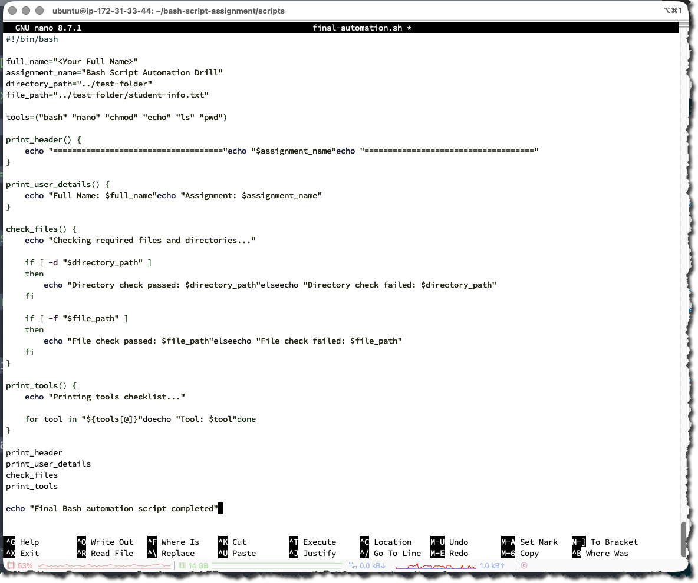

---

#### Screenshot 2 — Output of `./final-automation.sh`

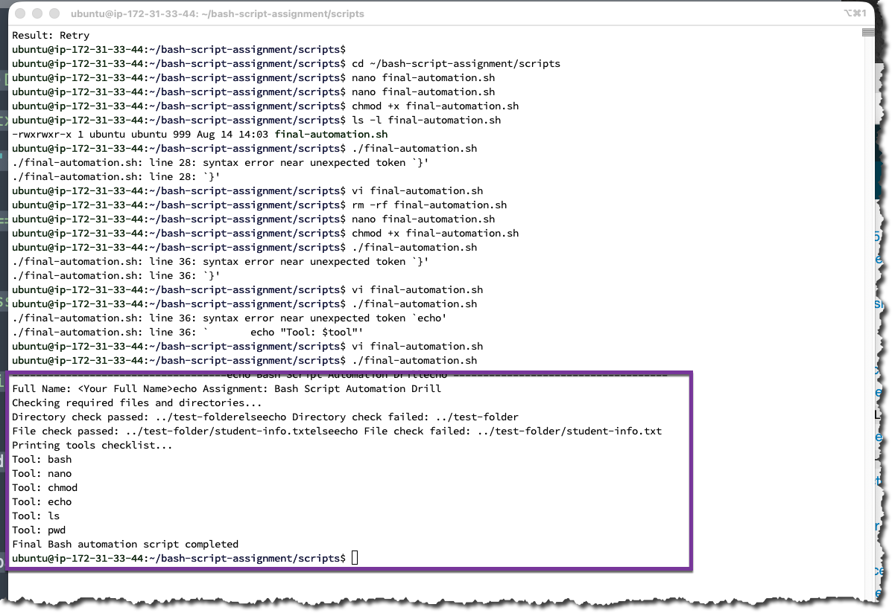

---

#### Screenshot 3 — Output of `ls -lah` showing all created scripts

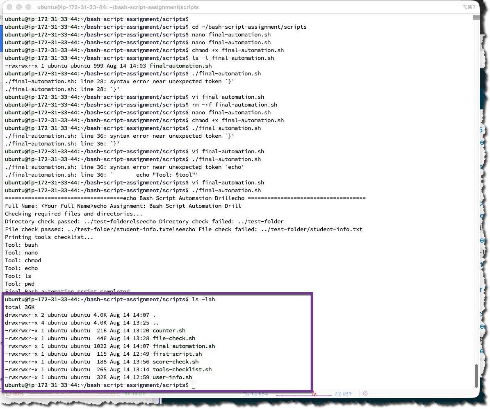

---

### Notes

---

Ansyour the following in your own words:

**1. What is a function in Bash?**

A function in Bash is a reusable block of code that performs a specific task. It's defined once with a name and can be called multiple times throughout a script without rewriting the code. Functions accept input through parameters (also called arguments) and can return output or values. They help organize code into logical, manageable pieces. For example, you might create a function `check_file()` that tests if a file exists and returns a status, then call this function from different parts of your script whenever you need to verify a file. In DevOps automation, functions are essential for modularizing scripts — they reduce code duplication, make scripts easier to test and maintain, and allow teams to build libraries of reusable automation tasks that can be shared across projects.

---

**2. Why are functions useful in scripts?**

Functions are useful because they eliminate code repetition and improve script organization. If you need to perform the same operation multiple times (like validating input, checking file existence, or making API calls), you write the code once in a function and call it wherever needed. This reduces errors because you maintain the logic in one place. Functions make scripts more readable — a well-named function like `validate_config()` clearly communicates its purpose. They also make scripts easier to test, debug, and maintain. In DevOps, functions enable you to build modular automation where complex tasks are broken into smaller, manageable pieces. Functions can be extracted into separate files and sourced into multiple scripts, creating a library of common DevOps operations. This promotes consistency, reduces development time, and makes large automation projects more scalable and maintainable.

---

**3. Which functions did we create in this script?**

The specific functions you created depend on your script. Common functions in DevOps Bash scripts include: `check_file()` or `validate_file()` to verify files exist, `log()` or `print_status()` to output standardized messages, `deploy()` to handle deployment logic, `health_check()` to verify services are running, `cleanup()` to remove temporary files, and `error_handler()` to manage error conditions. Functions typically correspond to logical operations in your script — each function handles one specific responsibility, making the main script cleaner and easier to follow.

---

**4. How does this final script combine variables, arrays, loops, conditionals, files, and functions?**

This final script brings together all the fundamental Bash concepts into a cohesive automation tool. Variables store configuration values and state. Arrays hold collections of related items (like a list of servers or tools). Loops iterate through arrays to process each item systematically. Conditionals (if-else statements) check conditions — like whether files exist or operations succeeded — and branch accordingly. File operations test for file/directory existence and read or write data. Functions encapsulate logic into reusable blocks that the main script calls. Together, these elements create a complete automation workflow: variables configure what to do, conditionals validate prerequisites, arrays organize collections, loops process each item, functions handle specific tasks, and file checks ensure the environment is ready. This combination makes scripts robust, maintainable, and poyourful enough to automate complex DevOps workflows like deployments, infrastructure provisioning, log analysis, and system monitoring at scale.

---

# LinkedIn Post (Required)

## Evidence

#### LinkedIn Post URL

Paste your LinkedIn post URL here:

[LinkedIn Post](https://www.linkedin.com/posts/subhamay-bhattacharyya-67753329_devops-bash-linux-share-7494033339415228416-QE5R/?utm_source=share&utm_medium=member_desktop&rcm=ACoAAAXzlvsBLGMTn7whkbpl6JdhO70ZuveqIQY)

---

#### Screenshot — Published LinkedIn post

---

# Submission Instructions

- Add all required screenshots in your submission
- Full name must be visible in required screenshots
- All script files must be created and run successfully
- Required notes must be ansyoured clearly for every task
- Do not expose sensitive information (keys, passwords, credentials)

---

# Completion Checklist

- [x] Task 1: Environment setup verified, workspace created (Screenshots 1–2, Notes ansyoured)
- [x] Task 2: First script created, executed, permissions verified (Screenshots 1–3, Notes ansyoured)
- [x] Task 3: Variables script created and run (Screenshots 1–2, Notes ansyoured)
- [x] Task 4: Arrays and loops script created and run (Screenshots 1–2, Notes ansyoured)
- [x] Task 5: Counter loop script created and run (Screenshots 1–2, Notes ansyoured)
- [x] Task 6: File validation script created and run (Screenshots 1–3, Notes ansyoured)
- [x] Task 7: Pass/Retry conditional script tested with both values (Screenshots 1–4, Notes ansyoured)
- [x] Task 8: Final automation script created and run (Screenshots 1–3, Notes ansyoured)
- [x] All scripts run without errors
- [x] Full Name visible in all required screenshots
- [x] LinkedIn post published and URL submitted
- [x] No sensitive data exposed

---

## 📌 About DMI & CloudAdvisory

DevOps Micro Internship (DMI) is a project-based DevOps program run by Pravin Mishra (The CloudAdvisory) focused on real-world execution, systems thinking, and career readiness.

It helps learners build strong DevOps foundations with hands-on experience.

---

## 📌 Resources

- 🌐 DMI Official Website: https://dmi.pravinmishra.com?utm_source=github&utm_medium=readme  
- 🎓 University: https://university.pravinmishra.com?utm_source=github&utm_medium=readme  
- 💬 Discord Community: https://discord.pravinmishra.com?utm_source=github&utm_medium=readme  
- 📝 Blog: https://dmi.pravinmishra.com/blog?utm_source=github&utm_medium=readme  
- ▶️ weTube Playlist: https://www.wetube.com/playlist?list=PLFeSNDtI4Cho  
- 🔗 Pravin Mishra (LinkedIn): https://www.linkedin.com/in/pravin-mishra-aws-trainer/  
- 🏢 CloudAdvisory (LinkedIn): https://www.linkedin.com/company/thecloudadvisory/

---

*This submission is part of DevOps Micro Internship (DMI) Cohort 3 — Agentic AI Track.*