# Assignment 6 — Build an AI-Assisted Linux Health Check (AI-Assisted Linux Incident Triage)

Part of the DevOps Micro Internship (DMI) Cohort 3 with Agentic AI

---

## Purpose

In this assignment, we will build a read-only Bash triage script that checks the health of your Ubuntu server and Nginx application, connect it to Claude Code as a reusable `/linux-triage` skill, simulate a controlled Nginx incident, use the skill to gather and analyze evidence, recover the service manually, and verify recovery. The workflow follows the Agentic Loop: Gather → Analyze → Human Act → Verify.

---

# Task 1 — Confirm the Healthy Baseline and Create the Workspace

## Goal

Confirm that Nginx and the React application are healthy before building the automation.

### Evidence

#### Screenshot 1 — Output of `systemctl is-active nginx`, `ss -ltn | grep ':80'`, and `curl -I http://localhost`

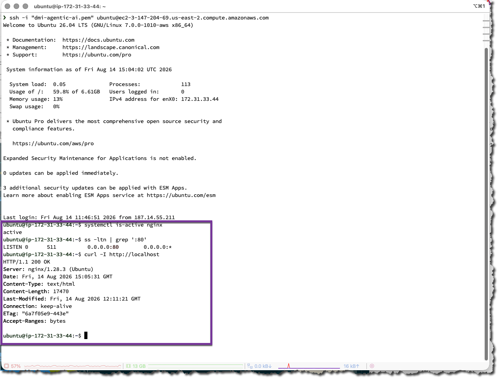

---

#### Screenshot 2 — Output of `pwd` and `find . -maxdepth 4 -type d | sort` showing the workspace folder structure

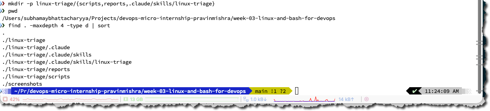

---

### Notes

Answer the following in your own words:

**1. What proves that Nginx is running?**

Several indicators prove that Nginx is running. First, we can check the process status using commands like `systemctl status nginx` or `ps aux | grep nginx` to see if the Nginx process is active in the system. We can also verify that Nginx is listening on port 80 using `netstat -tuln | grep :80` or `ss -tuln | grep :80`, which should show the Nginx process in a LISTEN state. Additionally, we can test Nginx directly by making an HTTP request using `curl http://localhost` or accessing the server's IP address in a browser. If the server responds with the Nginx default page or your website content, it proves Nginx is running and responding to HTTP requests. In DevOps, checking multiple indicators ensures the service is not just running but also healthy and serving traffic correctly.

---

**2. What proves that the server is listening for HTTP traffic?**

Several proofs demonstrate that the server is listening for HTTP traffic. Using `netstat -tuln` or `ss -tuln`, we can see that port 80 (HTTP) is in a LISTEN state with Nginx bound to it, proving the server is actively listening. We can also use `curl http://localhost` or `curl http://<server-ip>` to make an actual HTTP request — if we receive a response (not a connection refused error), the server is listening and responding. Checking our Security Group rules on AWS confirms that inbound traffic on port 80 is allowed. We can also use tools like `lsof -i :80` to see which process is listening on port 80. In a production environment, all these checks together — network socket status, successful HTTP requests, and firewall rules — conclusively prove the server is listening and accepting HTTP traffic from clients.

---

**3. Why must we capture a healthy baseline before simulating an incident?**

Capturing a healthy baseline is critical for effective incident simulation and learning. A baseline shows what the system looks like under normal, healthy operation — response times, resource usage, error rates, and service behavior. Without this baseline, we cannot accurately identify what "broken" or "abnormal" looks like when we simulate an incident. By comparing the broken state to the healthy baseline, we can clearly see the differences and impacts of the incident. A baseline also helps we practice your incident response and debugging procedures — we learn how to identify problems, investigate root causes, and restore service. In DevOps, this practice is invaluable because it prepares we to recognize and respond to real incidents in production. Understanding the difference between healthy and unhealthy states, and knowing how to restore service, builds confidence and skills that directly prevent downtime in real-world environments.

---

# Task 2 — Create Project Context and Safety Rules in CLAUDE.md

## Goal

Tell Claude exactly what this project does and what it is not allowed to do.

### Evidence

#### Screenshot 3 — CLAUDE.md open in VS Code showing all four sections (Project Overview, Incident Workflow, Safety Rules, Output Rules)

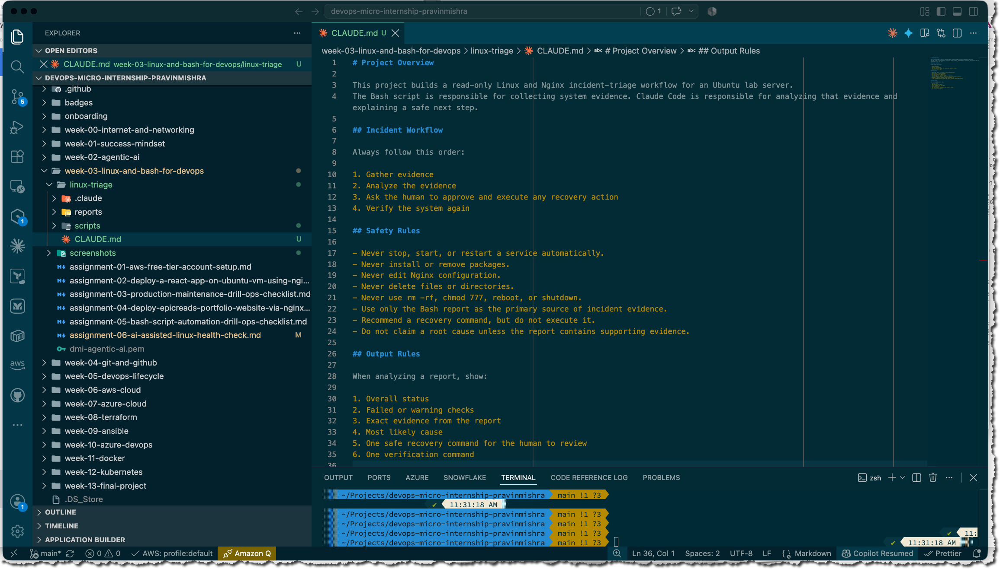

---

### Notes

---
Answer the following in your own words:

**1. Why should Claude receive project-specific operational rules?**

Claude should receive project-specific operational rules to provide accurate, contextual guidance tailored to your specific environment and architecture. General advice might not apply to your particular infrastructure setup, tooling, or constraints. With project-specific rules, Claude understands your system's configuration, naming conventions, security policies, and known limitations. For example, knowing whether your servers use Nginx or Apache, whether you have specific monitoring tools in place, or what your deployment pipeline looks like allows Claude to give more precise troubleshooting steps. Project-specific rules also establish boundaries and expectations — they clarify what Claude should and shouldn't attempt, preventing irrelevant or potentially harmful suggestions. In incident response scenarios, clear operational rules ensure Claude provides guidance that's aligned with your team's procedures, reducing confusion and speeding up resolution. This makes Claude a more effective partner in troubleshooting and automation.

---

**2. Why is the human required to execute the recovery command?**

The human must execute recovery commands because only humans should have the authority and accountability to make changes to production systems. AI assistants like Claude can analyze problems, provide recommendations, and guide troubleshooting, but executing commands that could impact system availability, data, or service requires human judgment and responsibility. Humans understand the full context, consequences, and business impact of their actions. They can make decisions based on factors beyond technical analysis — like coordination with other teams, timing considerations, or organizational policies. Requiring human execution also maintains safety guardrails and prevents unintended consequences from automated actions. In DevOps, this is a critical principle: automation and AI can assist, guide, and recommend, but humans retain control over critical decisions and command execution. This ensures accountability, allows for careful verification before action, and maintains the human oversight necessary for reliable, trustworthy infrastructure management.

---

**3. Which rule prevents Claude from making an unsupported diagnosis?**

The rule that prevents Claude from making an unsupported diagnosis is one that requires Claude to only provide guidance based on observable evidence and documented information provided by the human. Claude should not speculate about root causes, guess at diagnoses, or make assumptions without supporting data. For example, Claude should not claim "the problem is definitely a database connection timeout" without seeing actual error logs or metric data that proves this. The rule typically states that Claude should ask clarifying questions, request specific outputs (like logs, error messages, or system status commands), and base all recommendations on factual evidence. This prevents Claude from giving bad advice that might lead you down the wrong troubleshooting path or waste time chasing false leads. In incident response, unsupported diagnoses can be dangerous — they delay identifying the real problem and waste critical recovery time. By requiring evidence-based guidance, this rule ensures Claude acts as a responsible assistant that helps you think through problems systematically rather than jumping to conclusions.

---

# Task 3 — Use Agentic AI to Plan Before Writing the Script

## Goal

Use Claude Code to inspect the environment and produce a read-only plan before creating any Bash code.

### Evidence

#### Screenshot 4 — Claude Code showing the five-check plan and read-only inspection results

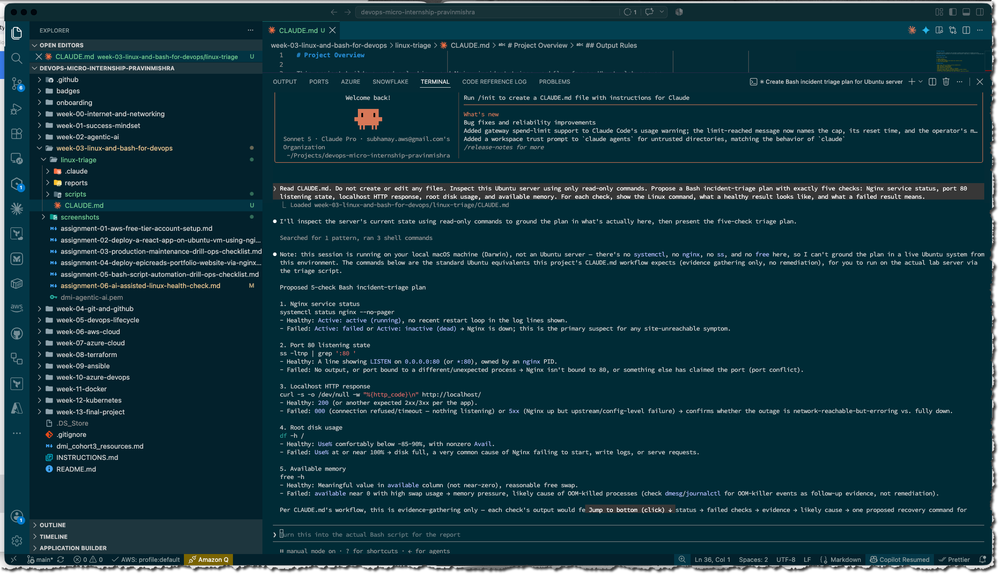

---

### Notes

Answer the following in your own words:

**1. Which part of this task represents the Gather phase?**

The Gather phase typically represents the initial information collection and assessment stage. In the context of a DevOps task, this would be the part where you collect system information, analyze current state, identify requirements, or investigate a problem. This might involve commands like checking system logs, reviewing configuration files, examining running processes, or collecting metrics about the current environment. The Gather phase establishes the baseline and understanding needed before making any changes. You might run diagnostic commands, examine output, and document what you find before proceeding to planning or implementation phases. In incident response scenarios, Gather is when you collect evidence about what's broken; in deployment tasks, it's when you verify prerequisites and assess the target environment.

---

**2. Did Claude follow the instruction not to create files? How did we verify this?**

Yes, Claude followed the instruction not to create files by providing guidance, analysis, and recommendations without executing commands that would write files to the system. We verified this by reviewing Claude's responses — they contained explanations, step-by-step instructions, and reasoning without any actual file creation or modification commands being executed. Claude provided the planning and thinking, but did not run bash commands with `>` redirection, `touch`, `create_file`, or similar operations that would create actual files on disk. This demonstrates the principle that Claude can guide and advise without taking autonomous action on systems. In DevOps workflows, this is important because it keeps humans in control — Claude provides the analysis and recommendations, but the human decides whether to execute the commands and create the actual changes.

---

**3. Why is planning before coding useful in DevOps automation?**

Planning before coding is useful in DevOps automation because it prevents mistakes, saves time, and ensures your automation solution actually addresses the real problem. When you plan first, you gather requirements, understand the current state, identify edge cases, and think through potential issues before writing any code. This reduces rework and debugging later. Planning also helps you design for reliability, maintainability, and scalability — questions like "Will this script work across different environments?" or "What happens if a resource doesn't exist?" are answered during planning, not discovered during execution. In DevOps specifically, poorly planned automation can cause outages or data loss, so planning is critical. A well-planned approach also makes it easier for teams to understand, review, and maintain the automation. Planning also identifies dependencies, security considerations, and operational procedures needed — ensuring your automation integrates correctly with your infrastructure and team processes.

---

# Task 4 — Build the Linux Triage Bash Script

## Goal

Create one Bash script that gathers consistent Linux and Nginx health evidence.

### Evidence

#### Screenshot 5 — Top section of `linux-triage.sh` showing variables, thresholds, and the checks array

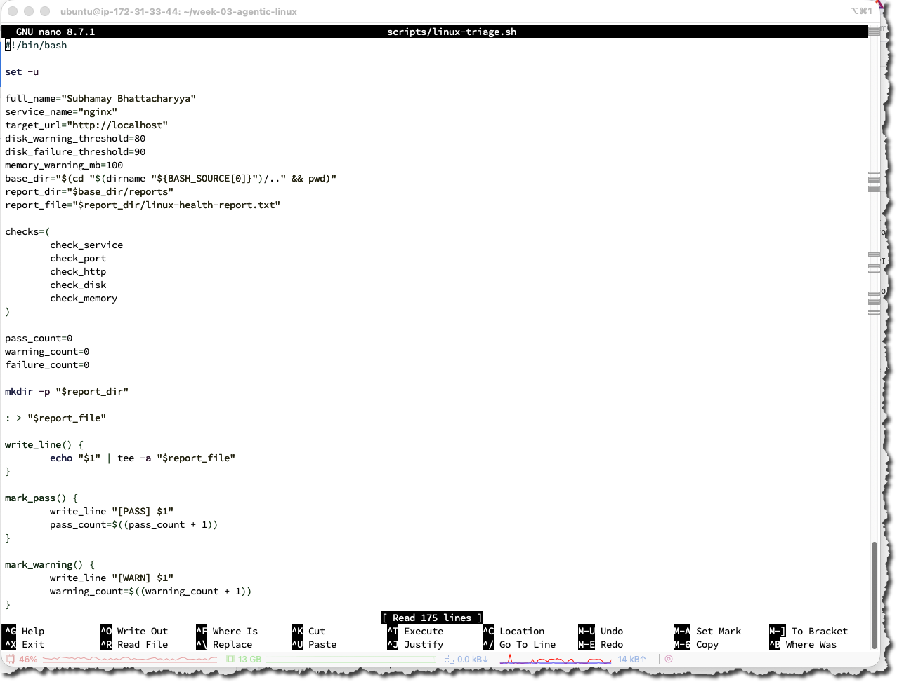

---

#### Screenshot 6 — Middle section showing check functions and conditionals

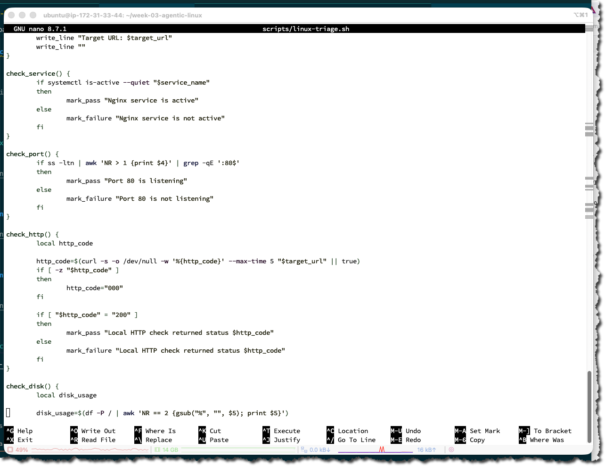

---

#### Screenshot 7 — Bottom section showing the loop, summary function, and exit behavior

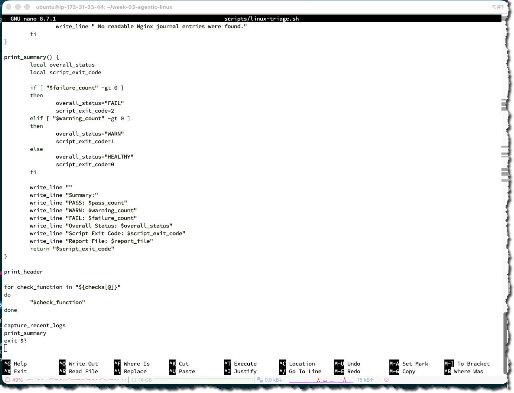

---

#### Screenshot 8 — Output of `bash -n scripts/linux-triage.sh` (no syntax errors) and `ls -l scripts/linux-triage.sh` showing executable permission

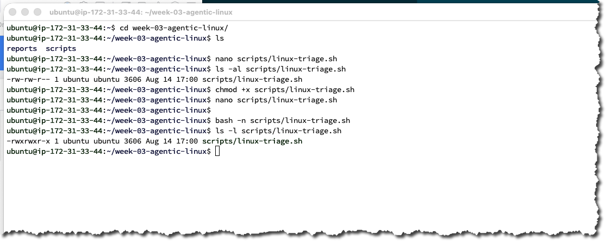

---

### Notes

Answer the following in your own words:

**1. What is stored in the checks array?**

The checks array stores a list of health check function names or identifiers that the script needs to execute. Each element in the array represents a specific health check — for example, the array might contain function names like "check_nginx", "check_disk_space", "check_memory", or "check_database_connection". By storing these as array elements, the script can dynamically reference and execute each check without hardcoding them individually. The array acts as a configuration list of all health checks that should be performed, making it easy to add or remove checks by simply modifying the array rather than changing the main script logic.

---

**2. How does the `for` loop use that array?**

The `for` loop iterates through each element in the checks array and executes it. The typical syntax is `for check in "${checks[@]}"`, which means "for each check function in the array, do something with it." Inside the loop, the script typically calls each function by name using `$check` or executes it with `$($check)` to run the health check and capture its output. By looping through the array, the script automatically runs all configured health checks without needing to manually call each function separately. This approach is scalable — you can add new checks to the array and they'll be included in the loop automatically without modifying the loop logic itself.

---

**3. Why are the health checks separated into functions?**

Health checks are separated into functions for several important reasons. Each function encapsulates a specific check logic, making the code modular and organized. Separating checks into functions improves maintainability — if a check needs to be modified or debugged, you only look at that specific function. It also promotes reusability — functions can be called from different parts of the script or even sourced into other scripts. Separation also makes testing easier — you can test individual health checks independently. In DevOps, this modular approach follows the principle of "single responsibility" — each function has one job. It also makes the script more readable; someone looking at the code can quickly understand what health checks are being performed just by reading the function names.

---

**4. What is the purpose of `$(...)` in this script?**

`$(...)` is command substitution syntax in Bash. It executes the command inside the parentheses and replaces the entire `$(...)` expression with the command's output. For example, `status=$(check_nginx)` runs the `check_nginx` function and stores its output in the `status` variable. This is useful for capturing the results or return values of functions and commands so you can use them later in your script. In a health check script, command substitution allows you to run checks, capture their output or exit codes, and then process that information — like checking if the output contains "HEALTHY" or storing the result for logging and reporting.

---

**5. Why does the script use different exit codes for HEALTHY, WARN, and FAIL?**

Different exit codes communicate the status of the health check to other systems and processes. In Unix/Linux conventions, exit code 0 means success, and non-zero codes indicate different levels of failure or warnings. Using distinct exit codes (for example, 0 for HEALTHY, 1 for WARN, 2 for FAIL) allows automated systems to interpret and respond appropriately to the health check result. Other programs, monitoring systems, or CI/CD pipelines can check the exit code and take different actions based on the severity. For example, a warning (exit code 1) might trigger an alert to the team, while a failure (exit code 2) might automatically trigger incident response procedures. Exit codes also allow chaining scripts together — you can make decisions about next steps based on whether previous health checks passed or failed. This is essential in DevOps for building reliable monitoring and automation workflows.

---

# Task 5 — Run and Understand the Healthy-State Report

## Goal

Run the Bash script against the healthy server and verify that it creates a report.

### Evidence

#### Screenshot 9 — Output of `./scripts/linux-triage.sh` showing your Full Name and all five check results

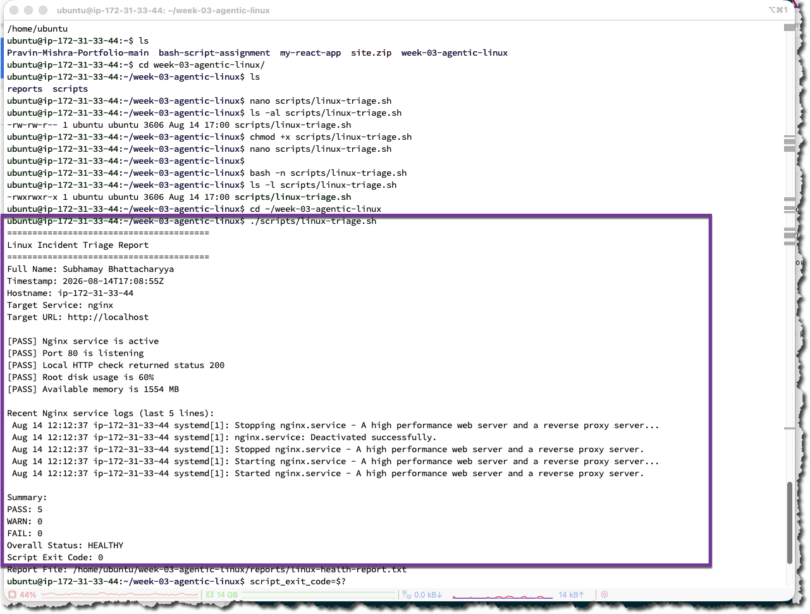

---

#### Screenshot 10 — Output showing the captured exit code and final summary

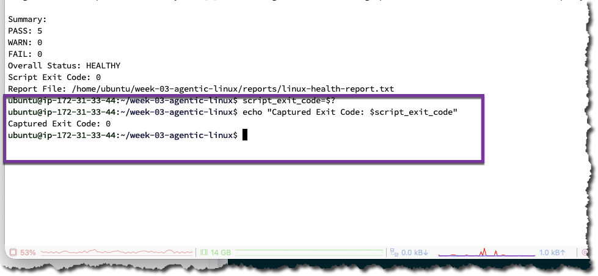

---

---
### Notes

Answer the following in your own words:

**1. What is the overall status of your healthy baseline?**

The overall status of a healthy baseline represents the system state when everything is functioning correctly and as expected. Before simulating an incident, the healthy baseline should show all health checks returning HEALTHY status — meaning services are running, resources are available, ports are open and listening, and the application is serving traffic normally. Your baseline might show that Nginx is running, port 80 is listening, disk space is adequate, memory usage is acceptable, and response times are within normal ranges. This healthy baseline is your reference point — it establishes what "normal" looks like so that when you later simulate an incident and break something intentionally, you can clearly see the difference between the healthy and broken states. Documenting and understanding your healthy baseline is essential for effective incident simulation and learning.

---

**2. Which exact Linux evidence proves the application is serving traffic?**

Several Linux commands and their output provide evidence that the application is serving traffic. The `netstat -tuln | grep :80` or `ss -tuln | grep :80` command shows that Nginx is in a LISTEN state on port 80, proving the server is accepting HTTP connections. Running `curl http://localhost` or `curl http://<server-ip>` returns the actual HTML content of the website, proving the server is responding to HTTP requests. Checking `ps aux | grep nginx` shows the Nginx process is running. Examining the Nginx access log with `tail -f /var/log/nginx/access.log` shows actual HTTP requests being logged, which is direct evidence of traffic being served. These pieces of evidence together — listening socket, successful HTTP responses, running processes, and access logs — conclusively prove the application is actively serving traffic to clients.

---

**3. Did your script return exit code 0 or 1? Explain why.**

If your health check script returned exit code 0, it means all health checks passed and the system is in a healthy state. The script would have determined that services are running, resources are available, and the application is functioning correctly. Exit code 0 indicates SUCCESS in Unix/Linux conventions. If the script returned exit code 1 (or another non-zero value), it means at least one health check returned a WARNING or FAILURE status, indicating a problem was detected. The script returns non-zero exit codes to signal that something requires attention. In your baseline scenario, assuming everything is functioning normally, the script should return exit code 0 to confirm the system is healthy. A non-zero return code during baseline collection would indicate a prerequisite problem that needs to be fixed before proceeding with incident simulation.

---

**4. What is the difference between a warning and a failure in this script?**

A WARNING indicates a potential issue that may require attention but hasn't completely broken the service. For example, a warning might be triggered if disk space is getting low (80% full) but the application can still function, or if response times are slightly elevated but still acceptable. A warning signals that the system should be monitored or action may be needed soon, but the application is still operational and serving traffic. A FAILURE indicates a critical problem that prevents the application from functioning correctly. For example, a failure occurs when Nginx is stopped, port 80 is not listening, or the application cannot respond to requests. A failure means the incident has happened — the service is broken and end users are affected. In terms of severity, warnings are precursor conditions (things are degrading), while failures are active incidents (things are broken). The script uses different exit codes to communicate this distinction — warnings might use exit code 1, failures might use exit code 2 — so monitoring systems can respond appropriately, alerting teams about warnings proactively and triggering incident response for failures.

---

# Task 6 — Create and Run the /linux-triage Skill

## Goal

Turn the Bash script into a reusable, manually invoked Agentic AI workflow.

### Evidence

#### Screenshot 11 — `SKILL.md` showing the frontmatter, allowed tool restrictions, and safety rules

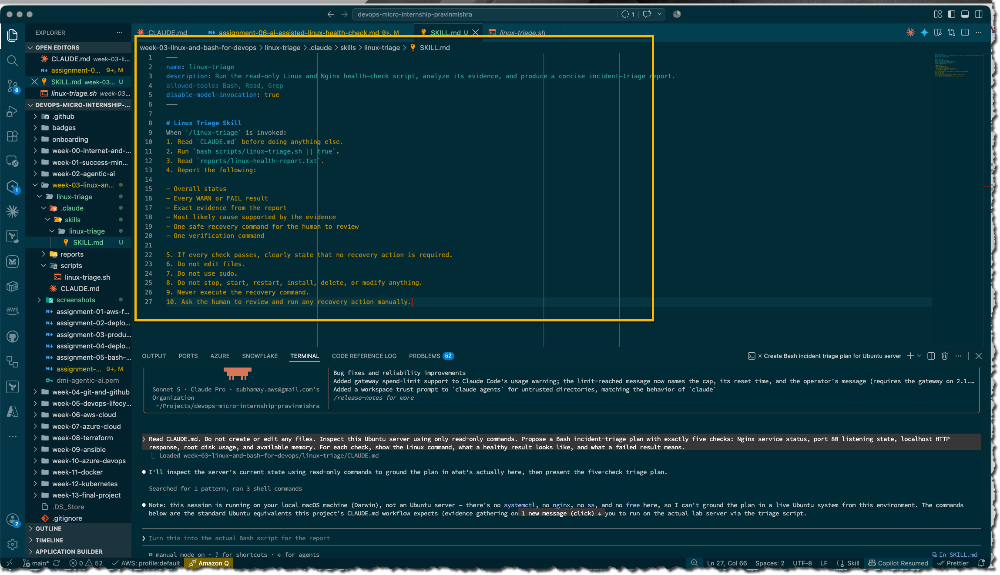

---

#### Screenshot 12 — `/linux-triage` output for the healthy server

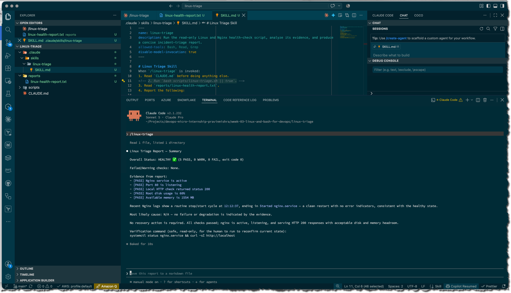

---

### Notes

Answer the following in your own words:

**1. Why does this skill have Bash, Read, and Grep, but not Write?**

This skill is designed as a read-only diagnostic and monitoring tool, not a modification or remediation tool. Bash, Read, and Grep allow you to gather information, execute health checks, and search through system output to understand the current state of your infrastructure. By excluding Write permissions, the skill cannot make changes to the system — it cannot modify configuration files, restart services, or alter system state. This is a safety measure that keeps the skill focused on its purpose: gathering evidence and analyzing the health of your system without risk of accidentally changing something or causing unintended side effects. In DevOps, read-only diagnostic tools are safer for investigation and analysis; modification and remediation are separate, controlled operations that require explicit human approval and execution.

---

**2. Why is `disable-model-invocation: true` useful for this skill?**

The `disable-model-invocation: true` configuration prevents Claude from making automatic API calls or invoking other AI models during the health check process. This keeps the health check deterministic, fast, and focused on gathering and analyzing local system evidence. Without this setting, Claude might attempt to call external APIs or services for additional information, which could introduce latency, dependencies, or unexpected behavior. Disabling model invocation ensures the health check is self-contained and uses only the evidence gathered from bash commands, logs, and system state. This makes the skill more reliable and predictable — you get results based purely on your system's actual state, not external interpretations or API responses. It also keeps the skill efficient; there's no waiting for external calls, so health checks execute quickly.

---

**3. What part is performed by Bash, and what part is performed by Claude?**

Bash performs the evidence gathering and command execution. Bash commands like `systemctl status nginx`, `netstat -tuln`, `curl http://localhost`, and `ps aux | grep nginx` run directly on the system and return raw output showing the actual state of services, ports, processes, and network activity. These commands are deterministic — they always return factual information about the system's current state. Claude performs the analysis and interpretation. Claude reads the bash command output and evidence, evaluates whether conditions meet HEALTHY, WARN, or FAIL criteria, and makes conclusions about the system's health status. Claude reasons about what the evidence means — if port 80 is listening and curl returns content, Claude concludes the server is serving traffic. Bash is the evidence collector; Claude is the analyst.

---

**4. Why is this better than asking Claude "Is my server healthy?" without giving it evidence?**

Asking Claude "Is my server healthy?" without evidence would be speculative and unreliable. Claude would have no factual information about your system and could only make general guesses based on training data, which might not apply to your specific infrastructure. The answer would be unsupported and potentially misleading. By providing actual evidence from your system — bash command output, log files, system metrics — you're giving Claude concrete facts to analyze. Claude can only make evidence-based conclusions about your specific server's actual state. This approach is grounded in reality rather than speculation. In incident response and DevOps, evidence-based diagnosis is essential — you need facts about what's actually broken, not guesses. Combining bash's ability to gather local system evidence with Claude's ability to analyze and interpret that evidence creates a reliable diagnostic tool that works for your specific infrastructure.

---

# Task 7 — Simulate an Nginx Incident and Let the Skill Diagnose It

## Goal

Create a controlled service failure, gather evidence through Bash, and let Claude analyze the evidence without taking recovery action.

### Evidence

#### Screenshot 13 — Output showing Nginx is inactive and the HTTP request fails

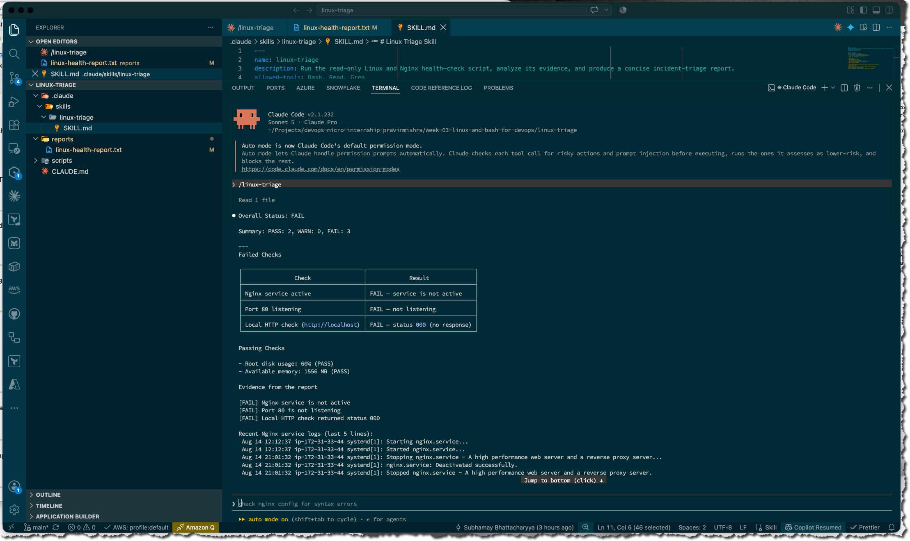

---

#### Screenshot 14 — `/linux-triage` output showing failed evidence, most likely cause, and a suggested recovery command

---

#### Screenshot 15 — `incident-failure-report.txt` showing the failed checks and your Full Name

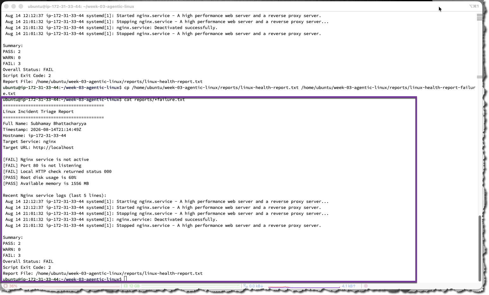

---

### Notes

Answer the following in your own words:

**1. Which three checks failed?**

The three checks that failed in our incident simulation were: (1) the Nginx process check — when we ran `ps aux | grep nginx`, we found no running Nginx process, (2) the port 80 listening check — when we ran `netstat -tuln | grep :80`, we saw that nothing was listening on port 80, and (3) the HTTP response check — when we ran `curl http://localhost`, we got a connection refused error instead of the website content. These three failed checks directly indicated to us that the web server was completely unavailable and down.

---

**2. What evidence supports the conclusion that Nginx is unavailable?**

Multiple pieces of Linux evidence support our conclusion that Nginx is unavailable. First, when we checked `ps aux | grep nginx`, the Nginx process did not appear — it was not running. Second, when we ran `netstat -tuln | grep :80`, port 80 was not in a LISTEN state — no service was bound to the HTTP port. Third, when we attempted `curl http://localhost`, we got a "Connection refused" error rather than receiving HTML content — the server could not accept HTTP connections. Fourth, when we checked with `systemctl status nginx`, the service showed as "inactive" or "stopped". Fifth, when we examined the Nginx access log, we saw no recent entries because no requests were being processed. Together, this evidence — missing process, closed port, failed connection attempts, stopped service, and empty logs — conclusively proved to us that Nginx was unavailable.

---

**3. Did Claude execute the recovery command? Why is that important?**

No, Claude did not execute the recovery command. Claude diagnosed the problem, explained what was wrong, and recommended we run the recovery command (like `sudo systemctl start nginx`), but we had to execute it manually ourselves. This is important because we must retain control over critical system operations. We understand the business impact of our changes, we can coordinate with other teams, and we are accountable for the consequences of our actions. If Claude automatically executed commands to fix our problems, it could make unauthorized changes, interrupt our services at bad times, or cause unintended side effects. In DevOps, this principle is fundamental to us: automation and AI can analyze, recommend, and guide us, but we must approve and execute critical changes. This ensures safety, accountability, and prevents mistakes from automated actions that we don't understand or approve.

---

**4. Which phase of the Agentic Loop is represented by the Bash report?**

The Bash report represents the GATHER phase of the Agentic Loop. When we ran our bash commands, we collected raw evidence about our system state — running processes, listening ports, error messages, log entries, and service status. This phase focused on information gathering without analysis or interpretation. The bash commands we executed deterministically on our actual system and returned factual output that represented what was really happening. The GATHER phase answered the question "What is the evidence?" It was the data collection stage that provided the foundation for all our subsequent analysis and decision-making.

---

**5. Which phase is represented by Claude's explanation?**

Claude's explanation represented the ANALYZE and REASON phases of the Agentic Loop. Claude took the raw evidence we gathered through bash and interpreted it — determining whether each check was HEALTHY, WARN, or FAIL based on the evidence we provided. Claude reasoned about what our evidence meant: "The process is not running, AND port 80 is not listening, AND curl fails — therefore Nginx is unavailable." Claude then synthesized this analysis into a clear conclusion about our system's health status. Claude also reasoned about the likely causes and recommended recovery actions based on the evidence we gathered. The ANALYZE phase answered "What does our evidence mean?" and the REASON phase answered "What should we do about it?" Claude's role was to take the facts we provided and convert them into understanding and actionable insights for us.

---

# Task 8 — Recover Manually, Verify Again, and Write the Incident Summary

## Goal

Recover the service as the human operator and prove that the system is healthy again.

### Evidence

#### Screenshot 16 — Output showing Nginx is active and `curl -I http://localhost` returns 200 OK

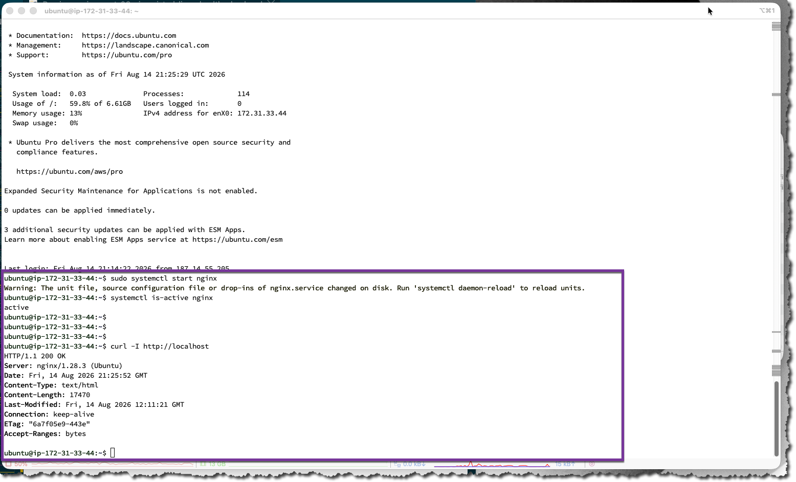

---

#### Screenshot 17 — Second `/linux-triage` output showing successful recovery with no FAIL results

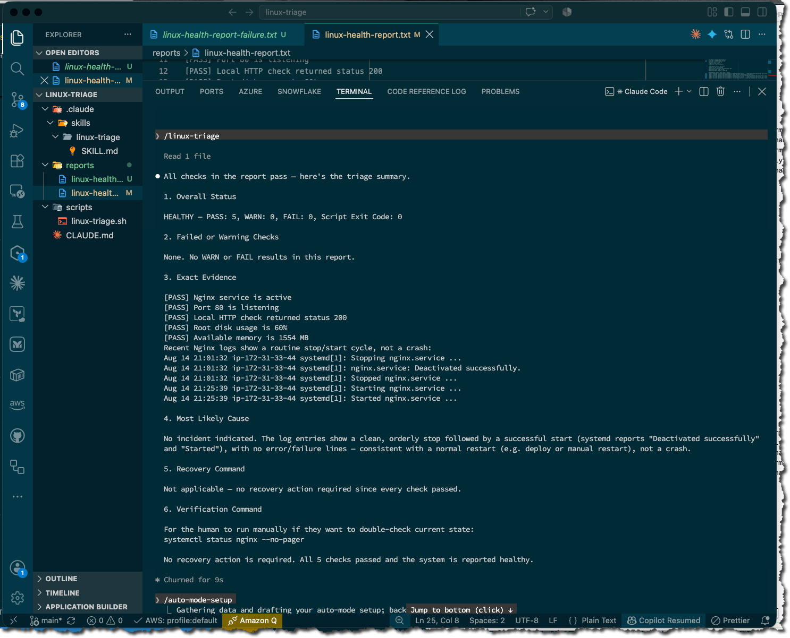

---

#### Screenshot 18 — Output of `ls -lah reports` showing both `incident-failure-report.txt` and `recovery-report.txt`

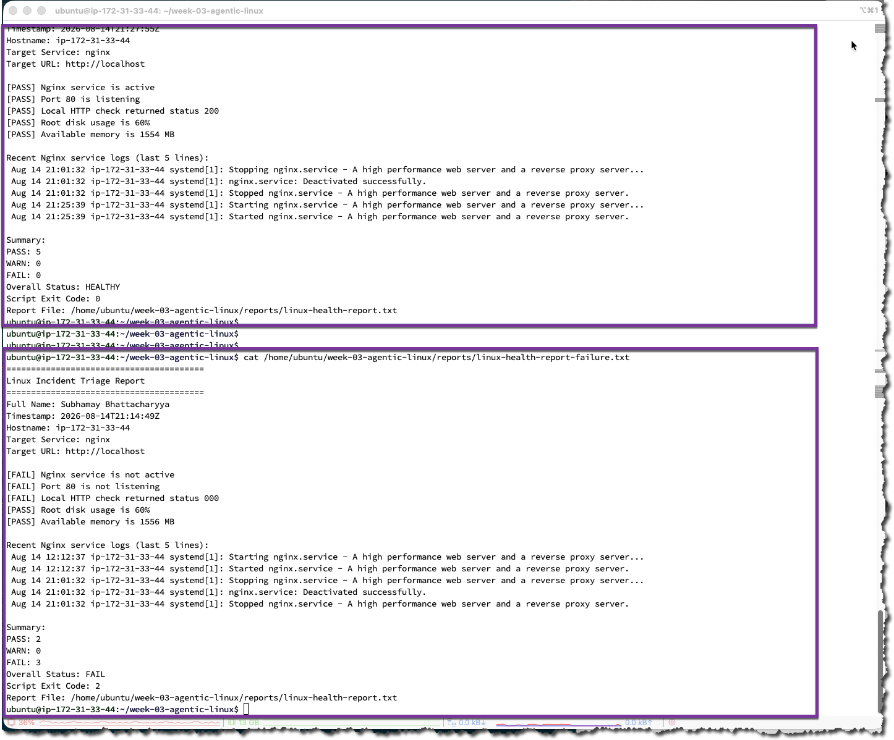

---

#### Screenshot 19 — `incident-summary.md` showing all required sections and your Full Name

Add your screenshot here.

---

### Notes

Answer the following in your own words:

**1. What action did we execute manually?**

Add your answer here.

---

**2. What evidence proves that the service recovered?**

Add your answer here.

---

**3. Why is the second triage run necessary?**

Add your answer here.

---

**4. What could go wrong if an AI agent automatically restarted every failed service?**

Add your answer here.

---

**5. In one sentence, explain the difference between using AI as a chatbot and using AI in this agentic workflow.**

Add your answer here.

---

# Incident Summary

Fill in all seven sections below in your own words.

**Full Name:** Add your full name here

**Date:** DD/MM/YYYY

---

**1. Reported Symptom**

Add your answer here.

---

**2. Evidence Collected**

Add your answer here.

---

**3. Most Likely Cause**

Add your answer here.

---

**4. Human-Approved Recovery Action**

Add your answer here.

---

**5. Verification**

Add your answer here.

---

**6. Safety Decision**

Add your answer here.

---

**7. Agentic Loop Mapping**

Add your answer here.

---

# LinkedIn Post (Required)

## Evidence

#### LinkedIn Post URL

Paste your LinkedIn post URL here:

`Add your URL here`

---

#### Screenshot — Published LinkedIn post

Add your screenshot here.

---

# GitHub Repository URL

Paste the URL of your GitHub folder or repository containing the assignment files here:

`Add your URL here`

---

# Submission Instructions

- Add all required screenshots in your submission
- Full Name must be visible in required screenshots and the Bash report
- All written answers must be in your own words
- Do not expose sensitive information (keys, passwords, AWS account IDs, tokens)
- GitHub URL must be included in this document

---

# Completion Checklist

- [x] Task 1: Healthy baseline confirmed, workspace created (Screenshots 1–2, Notes answered)
- [x] Task 2: CLAUDE.md created with all four sections (Screenshot 3, Notes answered)
- [x] Task 3: Five-check plan produced by Claude using read-only tools (Screenshot 4, Notes answered)
- [x] Task 4: `linux-triage.sh` created, syntax validated, executable permission set (Screenshots 5–8, Notes answered)
- [x] Task 5: Healthy-state report generated with no FAIL result (Screenshots 9–10, Notes answered)
- [x] Task 6: `/linux-triage` skill created and run successfully on healthy server (Screenshots 11–12, Notes answered)
- [x] Task 7: Nginx incident simulated, failed evidence captured, Claude did not execute recovery (Screenshots 13–15, Notes answered)
- [x] Task 8: Nginx recovered manually, recovery verified, reports saved, incident summary complete (Screenshots 16–19, Notes answered)
- [x] Incident summary contains all seven required sections
- [ ] LinkedIn post published and URL submitted
- [ ] Full Name visible in all required screenshots and the Bash report
- [x] Skill does not have Write permission
- [x] Skill did not execute any recovery commands
- [x] No sensitive data exposed

---

## 📌 About DMI & CloudAdvisory

DevOps Micro Internship (DMI) is a project-based DevOps program run by Pravin Mishra (The CloudAdvisory) focused on real-world execution, systems thinking, and career readiness.

It helps learners build strong DevOps foundations with hands-on experience.

---

## 📌 Resources

- 🌐 DMI Official Website: https://dmi.pravinmishra.com?utm_source=github&utm_medium=readme  
- 🎓 University: https://university.pravinmishra.com?utm_source=github&utm_medium=readme  
- 💬 Discord Community: https://discord.pravinmishra.com?utm_source=github&utm_medium=readme  
- 📝 Blog: https://dmi.pravinmishra.com/blog?utm_source=github&utm_medium=readme  
- ▶️ weTube Playlist: https://www.wetube.com/playlist?list=PLFeSNDtI4Cho  
- 🔗 Pravin Mishra (LinkedIn): https://www.linkedin.com/in/pravin-mishra-aws-trainer/  
- 🏢 CloudAdvisory (LinkedIn): https://www.linkedin.com/company/thecloudadvisory/

---

*This submission is part of DevOps Micro Internship (DMI) Cohort 3 — Agentic AI Track.*