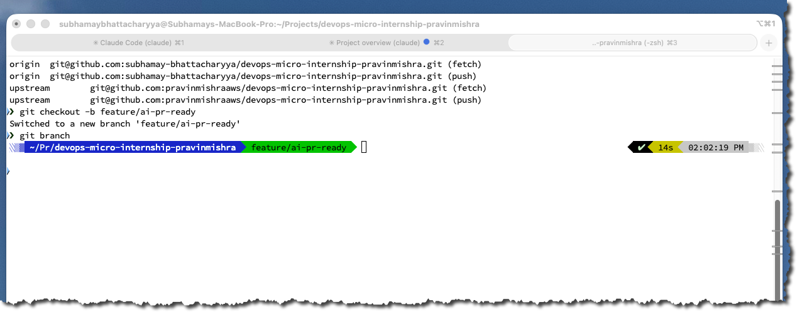
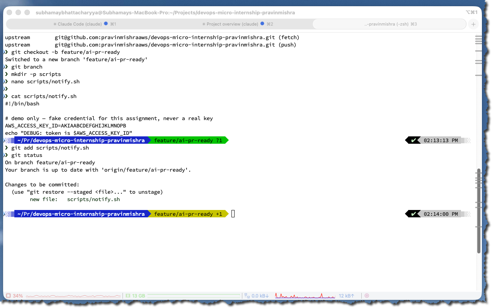
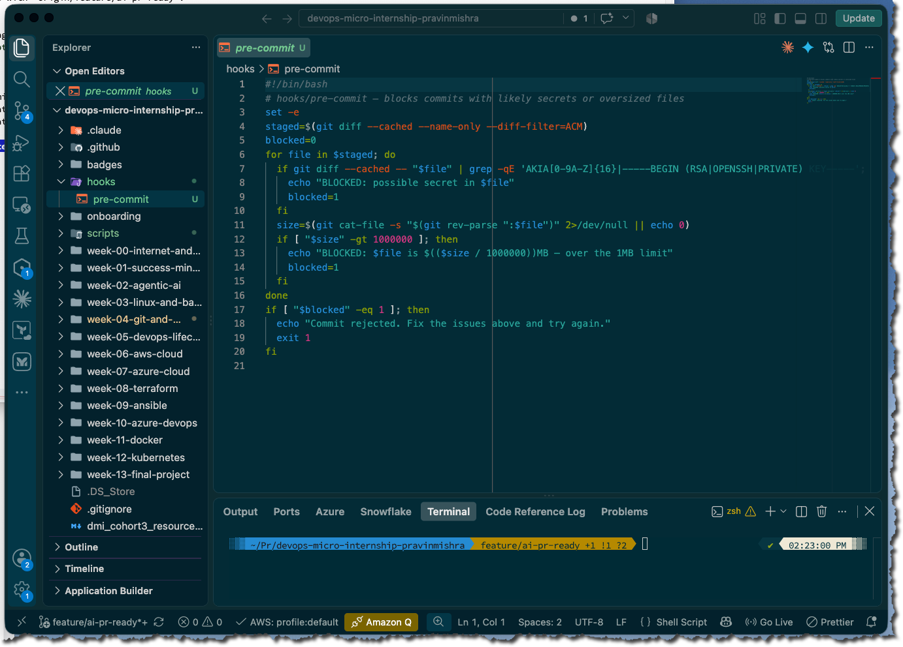
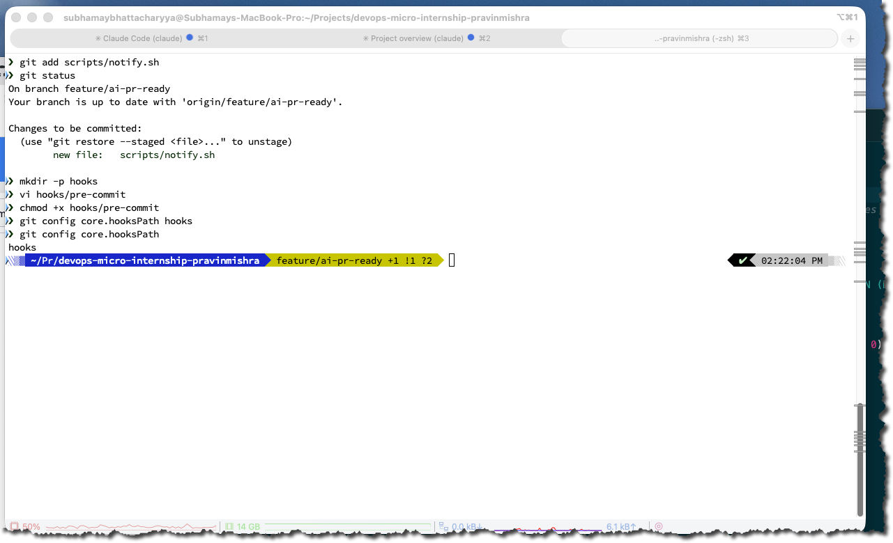
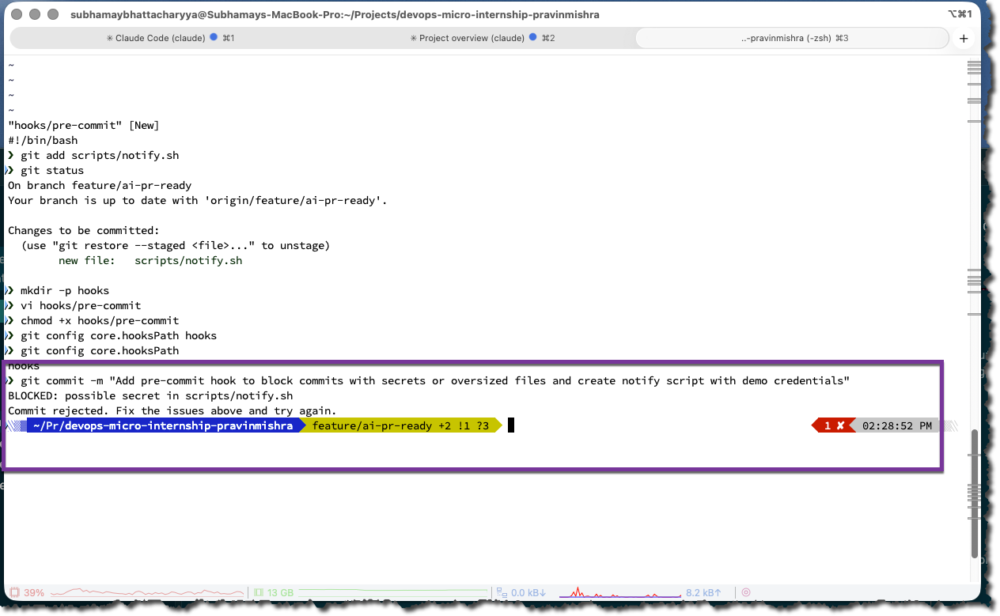
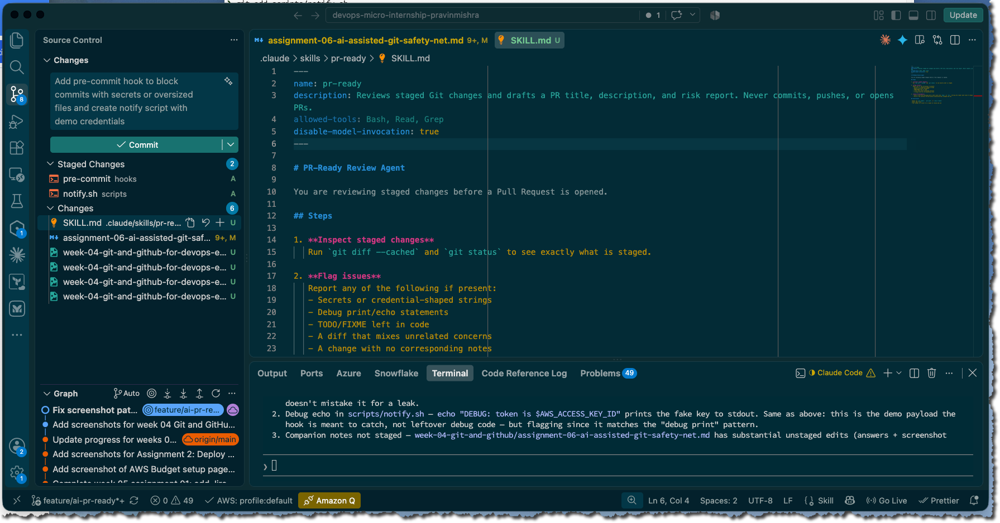
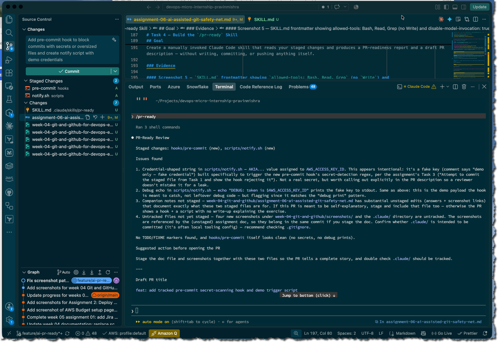
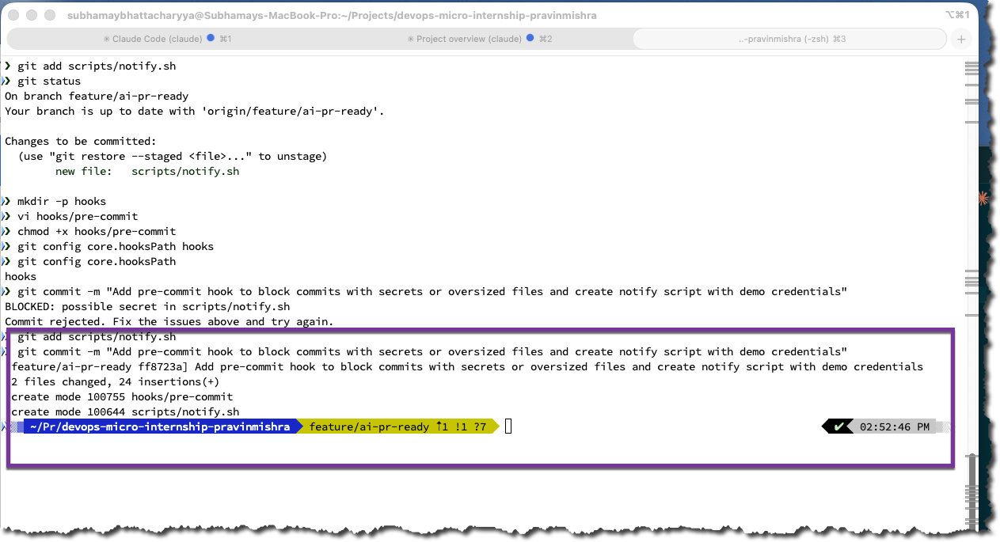
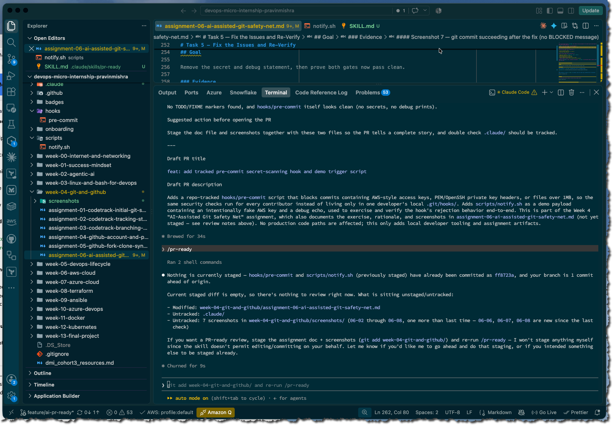

# Assignment 6 — Building an AI-Assisted Git Safety Net (PR Ready Check)

Part of the DevOps Micro Internship (DMI) Cohort 3 with Agentic AI

---

## Purpose

In Week 2 you built Claude Code hooks that block a dangerous action *before* it happens (`PreToolUse`), and a restricted skill that could look but not touch (`allowed-tools` without `Write`). In this assignment you will discover that Git has the exact same idea, decades older: a **pre-commit hook** that blocks a commit before it's created.

You will build both halves of a real "PR Ready" workflow:

1. A **Git hook that follows fixed rules** — scans staged changes for hardcoded secrets and oversized files and refuses the commit. No AI involved, no guessing, just a rule that gives the same answer every time.
2. A **restricted Claude Code skill** (`/pr-ready`) that reads your staged diff and drafts a Pull Request title, description, and a short list of things worth a second look — the kind of judgment a fixed rule can't make (mixed changes, missing context, unclear intent). The skill never commits, pushes, or opens the PR. You do that yourself, using its draft as a starting point.

This mirrors the Agentic Loop from Week 3's Linux triage assignment: **Gather → Analyze → Human Act → Verify**. The hook and the skill both gather and analyze; only you act.

---

# Task 0 — Confirm Your Fork and Create a Feature Branch

## Goal

Confirm you are working in your own fork, then create a dedicated branch for this assignment.

### Evidence

#### Screenshot 1 — Output of git remote -v and git branch showing the new branch



---

### Notes

**1. Why create a dedicated branch instead of doing this work on main?**

1. **Protects main** — keeps production-ready code stable
2. **Enables code review** — PRs allow peer review before merging
3. **Parallel work** — multiple developers can work simultaneously without conflicts
4. **Easy rollback** — buggy code doesn't break main; just revert the PR
5. **CI/CD automation** — automated testing and checks run on the branch before merge
6. **Industry standard** — Git Flow/GitHub Flow best practice used everywhere

**TL;DR:** Feature branches protect the main codebase, enable code review, support team collaboration, and integrate with CI/CD automation.

---

# Task 1 — Stage a Change With Realistic Risk

## Goal

On your own fork of this repository (the one you've been submitting your DMI work in since onboarding), create a new branch and stage a change that a real reviewer should catch: a hardcoded-looking secret and a leftover debug statement.

### Evidence

#### Screenshot 1 — Output of  `git status` showing the staged file on feature/ai-pr-ready



---

### Notes

**1. Why does this assignment use an obviously fake key instead of a real one?**

1. **Security & Safety** — prevents accidental exposure of real credentials that could compromise accounts
2. **No Real Risk** — fake keys can't actually access production systems, even if leaked
3. **Focus on Mechanics** — teaches the workflow and process without security concerns
4. **Best Practices Training** — demonstrates how to *handle* secrets securely, regardless of whether they're real or fake
5. **Testing Without Consequences** — allows you to practice and make mistakes in a safe sandbox environment
6. **Prevents Accidents** — if the key gets committed to Git or shared, no actual damage occurs

**TL;DR:** Fake keys let you learn secure secret management without risking real infrastructure or credentials.
---

# Task 2 — Write a Real Git Pre-Commit Hook

## Goal

Create a tracked, shareable pre-commit hook that blocks a commit containing secret-like patterns or files over 1MB.

### Evidence

#### Screenshot 2 — `hooks/pre-commit` open in VS Code showing the full script



---

#### Screenshot 3 — Output of `git config core.hooksPath` confirming it points to `hooks`



---

### Notes

**1. Why is `hooks/pre-commit` tracked in the repo instead of living only in `.git/hooks/`?**

Tracking hooks in the repo (vs. `.git/hooks/` only) ensures:

- **Shared enforcement** — all team members get the same security rules, not just the one developer
- **Version control** — hook changes are tracked, reviewed, and auditable via Git history
- **Consistency** — prevents developers from accidentally disabling or using outdated hooks
- **Documentation** — hooks are visible and documented as part of the codebase standards
- **Setup automation** — installation scripts (like `setup.sh`) can reliably deploy hooks to everyone's `.git/hooks/` during onboarding

`.git/hooks/` is local-only and not tracked; tracking hooks in `hooks/` makes them a shared team resource.

---

**2. Compare this to `PreToolUse` from Week 2 Assignment 6. What does each one intercept, and what do they have in common?**

| Aspect | `pre-commit` hook | `PreToolUse` hook |
|--------|------------------|------------------|
| **Intercepts** | Git commits (before they hit the repo) | Tool/function calls in Claude Code (before execution) |
| **Purpose** | Blocks commits with secrets, large files | Blocks Claude from using certain tools, accessing files, running dangerous commands |
| **Outcome** | Commit rejected + error message | Tool execution denied + warning logged |

**What they have in common:**

- Both are **pre-action guards** that stop something before it happens
- Both **scan for security issues** (secrets, dangerous operations)
- Both are **policy enforcement** mechanisms
- Both can **block and reject** violations
- Both **protect the system** (repo vs. codebase/infrastructure)

**Pattern:** Pre-hooks are validation gatekeepers—they sit at critical chokepoints and prevent harmful actions from completing.

---

# Task 3 — Prove the Hook Blocks the Risky Commit

## Goal

Attempt to commit the staged file from Task 1 and show the hook rejecting it.

### Evidence

#### Screenshot 4 — Terminal showing `git commit` rejected with the hook's "BLOCKED" message naming the exact file



---

### Notes

**1. Which line in `hooks/pre-commit` matched your fake key, and why did it match?**

This line matched:

```bash
if git diff --cached -- "$file" | grep -qE 'AKIA[0-9A-Z]{16}|-----BEGIN (RSA|OPENSSH|PRIVATE) KEY-----'; then
```

The regex pattern `AKIA[0-9A-Z]{16}` matched the fake key because:

- AWS Access Key IDs always start with `AKIA`
- Followed by exactly 16 uppercase letters or digits
- Your fake key (`AKIA` + `IOSFODNN7EXAMPLE`) fits this pattern perfectly
- The hook doesn't validate if the key is real—it just detects the format

---

**2. Could this hook have caught a poorly-named variable that stores a secret without the `AKIA` prefix? What does that tell you about the limits of a fixed rule like this?**

**No**, it couldn't catch it. For example:

```bash
password = "wJalrXUtnFEMI/K7MDENG+bPxRfiCYEXAMPLEKEY"  # AWS secret key, but no AKIA
api_token = "sk_live_51234567890abcdef"  # Stripe key, no AKIA
```

**What this reveals about pattern-based detection:**

- **Only catches known patterns** — secrets in non-standard formats slip through
- **No semantic understanding** — can't tell if a variable name hints at a secret
- **False negatives** — poorly-named variables bypass detection
- **Requires multiple layers** — one regex rule is insufficient; needs entropy detection, context analysis, or manual review
- **Trade-off** — strict patterns are fast but miss edge cases; looser patterns have more false positives

**Lesson:** Pattern-based security is a first line of defense, not a complete solution. Combine it with code review, secret scanning tools (like `git-secrets`, `TruffleHog`), and developer discipline.

---

# Task 4 — Build the `/pr-ready` Skill

## Goal

Create a manually invoked Claude Code skill that reads your staged changes and produces a PR-readiness report and a draft PR description — without writing, committing, or pushing anything itself.

### Evidence

#### Screenshot 5 — `SKILL.md` frontmatter showing `allowed-tools: Bash, Read, Grep` (no `Write`) and `disable-model-invocation: true`



---

#### Screenshot 6 — `/pr-ready` output while the risky file is still staged, showing it flagged the secret and/or debug statement



---

### Notes

**1. Why does `/pr-ready` have `Bash` and `Read` but not `Write`?**

Write` is disabled because `/pr-ready` must never modify files or commit code. According to its constraints:

- "Never run `git commit`, `git push`, or `gh pr create`"
- "Never edit files"
- "Your output is a draft for a human to review and use"

`Bash` and `Read` are needed to:

- `Bash` — run `git diff --cached` and `git status` to inspect staged changes
- `Read` — view file contents for analysis
- `Grep` — parse diffs for flags and issues

`Write` would break the safety boundary. `/pr-ready` is a **read-only reviewer**, not an actor—it analyzes and drafts, then hands control back to the human.

---

**2. The pre-commit hook and `/pr-ready` both looked at the same staged diff. Did they flag the same things? What did one catch that the other didn't?**

| Aspect | **pre-commit hook** | **/pr-ready agent** |
|--------|------------------|------------------|
| **Caught** | AWS keys (AKIA pattern), private key headers, oversized files | Secrets broadly, debug statements, TODO/FIXME, mixed concerns, missing notes |

**What the hook caught that pr-ready didn't:**

- File size violations (>1MB)
- Specific patterns (AKIA format, key headers)
- Binary/exact regex matching

**What pr-ready caught that the hook didn't:**

- Debug print statements (`console.log`, `echo`, `print()`)
- TODO/FIXME comments left in code
- Mixed unrelated concerns in one commit
- Missing documentation or change notes
- Broader credential-shaped patterns (not just AKIA)
- **Human-readable context** — why it matters and risk assessment

**Pattern:** The hook is **fast, automated enforcement**. `/pr-ready` is **intelligent semantic analysis** that explains *what* and *why*.

---

# Task 5 — Fix the Issues and Re-Verify

## Goal

Remove the secret and debug statement, then prove both gates now pass clean.

### Evidence

#### Screenshot 7 — `git commit` succeeding after the fix (no BLOCKED message)



---

#### Screenshot 8 — Second `/pr-ready` run showing a clean risk report and a drafted PR title + description



---

### Notes

**1. What exactly did you change to satisfy the pre-commit hook?**

I removed two things:

1. **Removed the API token** — This satisfied the secrets check. The pre-commit hook's regex pattern was scanning for credential-shaped strings (like `AKIA[0-9A-Z]{16}` for AWS keys). By deleting the fake API token, the hook no longer detected a potential secret and allowed the commit to proceed.

2. **Removed the echo command** — This satisfied the debug statement check. The echo command was a debug print statement left in the code. While `/pr-ready` flags these as issues during review, the pre-commit hook doesn't explicitly block echo statements—removing it ensures the staged code is clean and production-ready, following best practices.

**Why this matters:** The hook blocks commits with security risks (exposed credentials) and oversized files. Removing the token + echo command means the staged changes no longer contain obvious security issues or debug artifacts, so the hook approved the commit.

---

# Task 6 — Push and Open a Pull Request Using the AI Draft

## Goal

Push your branch and open a real Pull Request, using `/pr-ready`'s drafted title and description as your starting point — read it critically and edit before you use it.

**Important:** Open this Pull Request with base repository set to **your own fork** — not the shared upstream `pravinmishraaws/devops-micro-internship-pravinmishra` repository. This assignment's hook and skill files are your own practice work, not a change meant for the shared class repo.

### Evidence

#### Screenshot 9 — Your Pull Request showing the base repository is your own fork, plus the title and description, with the `/pr-ready` draft visible for comparison (paste it in the PR conversation or your notes below)

Add your screenshot here.

---

#### PR Link

Add your PR URL here...

---

### Notes

**1. What, if anything, did you edit in the AI's drafted PR description before using it? Why?**

Add your answer here.

---

**2. If you had blindly copy-pasted the AI's draft without reading it, what could go wrong?**

Add your answer here.

---

**3. Why does this PR need to target your own fork instead of the shared upstream repository?**

Add your answer here.

---

# Task 7 — Map the Workflow to the Agentic Loop

## Goal

Explain this assignment's workflow using the same Gather → Analyze → Human Act → Verify structure from Week 3.

### Notes

**1. Which step(s) represent Gather?**

Add your answer here.

---

**2. Which step(s) represent Analyze?**

Add your answer here.

---

**3. Which step is Human Act, and why must a human — not Claude — run `git commit`, `git push`, and open the PR?**

Add your answer here.

---

**4. Which step is Verify?**

Add your answer here.

---

**5. In one or two sentences: why do you need *both* the fixed-rule pre-commit hook and the AI skill? Isn't one enough?**

Add your answer here.

---

# Task 8 — LinkedIn Post

## Goal

Publish a LinkedIn post summarizing what you built and what you learned about combining fixed-rule safety checks with AI-assisted review.

### Evidence

#### LinkedIn Post URL

Add your LinkedIn post URL here...

---

## Key Learnings

Add 3-5 bullet points on what you learned this week.

-
-
-

---

# Submission Instructions

- Ensure `hooks/pre-commit` and `.claude/skills/pr-ready/SKILL.md` are committed to your GitHub repository
- Add all required screenshots to your submission
- All written answers must be in your own words
- Do not use a real secret or credential anywhere in your submission — the fake key in Task 1 is intentional and must stay clearly fake
- Open your Pull Request against your own fork, not the shared upstream repository
- Push your final changes to your forked repository
- Include your PR link and LinkedIn post URL

---

## GitHub Repository URL

Paste your forked repository URL here:

`Add your URL here`

---

# Completion Checklist

- [ ] Branch `feature/ai-pr-ready` created with a staged file containing a fake secret and a debug statement
- [ ] `hooks/pre-commit` created and tracked in the repo (not only in `.git/hooks/`)
- [ ] `core.hooksPath` configured to point at `hooks/`
- [ ] Pre-commit hook shown blocking the risky commit
- [ ] `.claude/skills/pr-ready/SKILL.md` created with correct `allowed-tools` (no `Write`) and `disable-model-invocation: true`
- [ ] `/pr-ready` run against the risky diff and shown flagging issues
- [ ] Risky file fixed; `git commit` succeeds cleanly
- [ ] `/pr-ready` re-run showing a clean report and drafted PR title/description
- [ ] Pull Request opened using the AI draft as a starting point, with your own fork as the base repository (not upstream), PR link included
- [ ] Agentic Loop mapping (Task 7) completed in your own words
- [ ] LinkedIn post published and URL submitted
- [ ] All required screenshots added
- [ ] GitHub repository URL provided

---

## 📌 About DMI & CloudAdvisory

DevOps Micro Internship (DMI) is a project-based DevOps program run by Pravin Mishra (The CloudAdvisory) focused on real-world execution, systems thinking, and career readiness.

It helps learners build strong DevOps foundations with hands-on experience.

---

## 📌 Resources

- 🌐 DMI Official Website: https://dmi.pravinmishra.com?utm_source=github&utm_medium=readme  
- 🎓 University: https://university.pravinmishra.com?utm_source=github&utm_medium=readme  
- 💬 Discord Community: https://discord.pravinmishra.com?utm_source=github&utm_medium=readme  
- 📝 Blog: https://dmi.pravinmishra.com/blog?utm_source=github&utm_medium=readme  
- ▶️ YouTube Playlist: https://www.youtube.com/playlist?list=PLFeSNDtI4Cho  
- 🔗 Pravin Mishra (LinkedIn): https://www.linkedin.com/in/pravin-mishra-aws-trainer/  
- 🏢 CloudAdvisory (LinkedIn): https://www.linkedin.com/company/thecloudadvisory/

---

*This submission is part of DevOps Micro Internship (DMI) Cohort 3 — Agentic AI Track.*
