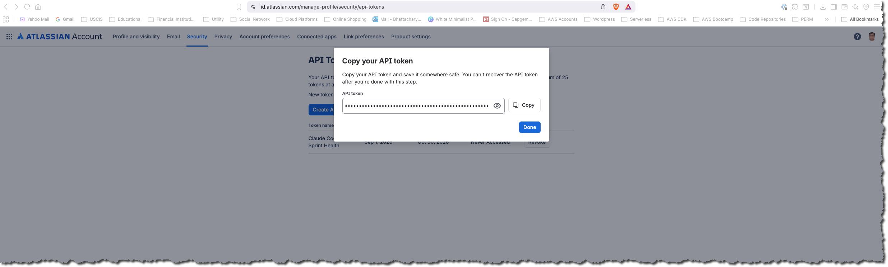
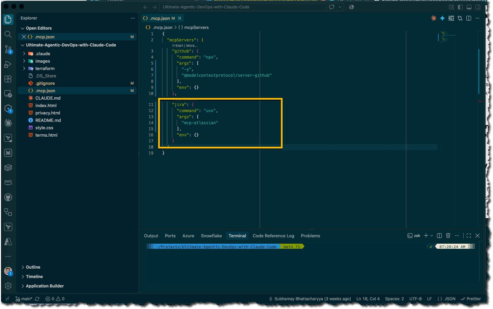
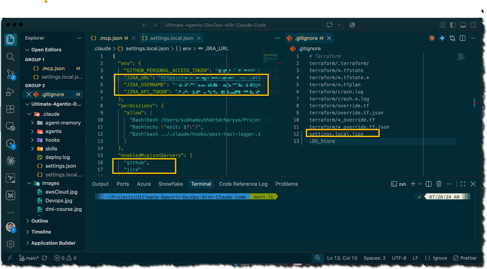
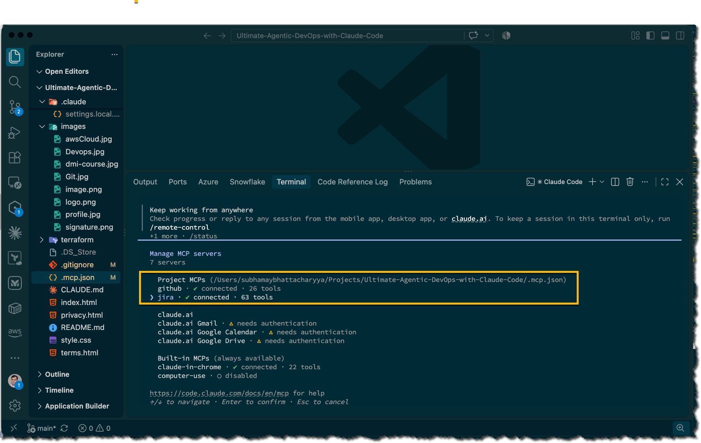
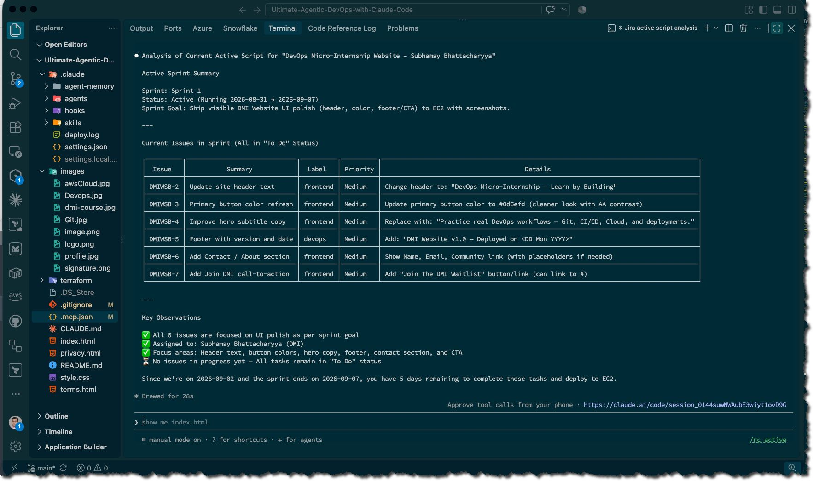
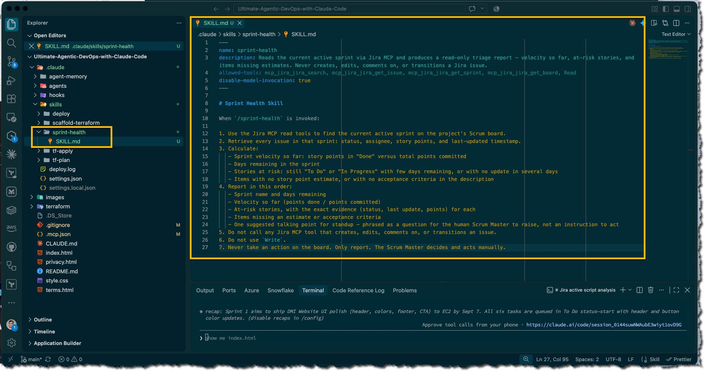
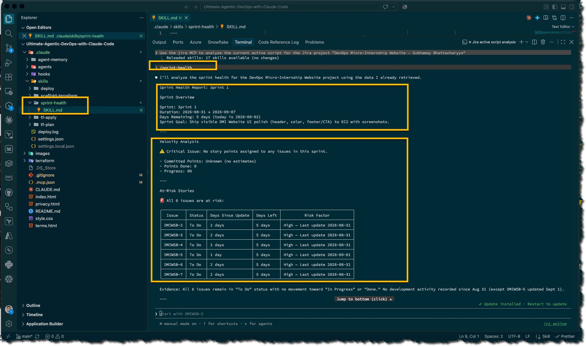
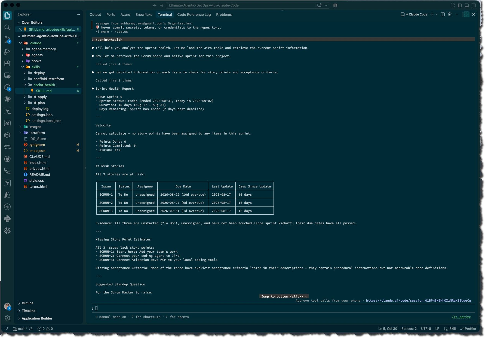

# Assignment 5 — AI-Assisted Sprint Health Report via Jira MCP

Part of the DevOps Micro Internship (DMI) Cohort 3 with Agentic AI

---

## Purpose

In this assignment, you will connect Claude Code to your Jira board through an MCP server, the same way you connected it to GitHub in Week 2, and build a read-only `/sprint-health` skill. The skill reads your current sprint through Jira's API and reports sprint velocity, stories at risk of missing the sprint, and items missing an estimate — but it must never create, edit, comment on, or transition a single ticket itself. You will prove that boundary holds by making a real change on the board yourself and confirming the skill only ever reports, never acts.

---

# Task 1 — Create a Jira API Token

## Goal

Generate an API token from your Atlassian account that the MCP server will use to authenticate with your Jira site. Do not screenshot the token value itself.

### Evidence

#### Screenshot 1 — Jira API token creation confirmation page showing the token name, with the token value not visible



### Notes You Must Write (Very Important):

Why does the MCP server need your site URL and account email in addition to the token?

The MCP server requires these three pieces of information because each serves a distinct purpose in establishing a secure and properly-routed connection:

1. **Site URL** - Specifies the server instance or deployment to connect to. Different organizations or services may host their MCP servers on different domains or endpoints. The URL tells the connector exactly where to send requests.

2. **Account Email** - Identifies the specific user account or workspace within that server instance. Many services support multiple accounts or workspaces per user. The email ensures requests are scoped to the correct account and that permissions/data access is limited to what that account can access.

3. **Token** - Provides authentication proof that you have valid credentials and authorization to access the server. The token proves you are who you claim to be, but it doesn't contain routing information.

Together, these three elements work as: "I am [email] trying to access [site URL] and here's my proof of authorization [token]." This allows the MCP server to verify your identity, route your request to the correct instance, and apply account-specific permissions and data access controls.

Without the URL, the server wouldn't know which instance to connect to. Without the email, it wouldn't know which account's data to return. Without the token, there would be no proof of authorization.

---

# Task 2 — Create .mcp.json at the Project Root

## Goal

Create or update `.mcp.json` at your project root with a Jira MCP server block, following the same shape as the GitHub MCP server you configured in Week 2.

### Evidence

#### Screenshot 2 — `.mcp.json` open in VS Code showing the Jira server configuration



### Notes You Must Write (Very Important):

Compare this jira block to the github block from Week 2 Assignment 5. The GitHub server ran via npx (a Node.js package); this one runs via uvx (a Python package) — what stays exactly the same shape despite that difference, and why doesn't Claude Code care which language a given MCP server is written in?

**What Stays Exactly the Same:**

The *MCP server configuration structure* and *protocol interface* remain identical:

1. **Configuration Shape** - Both blocks follow the exact same JSON structure with `command`, `args`, and `env` properties
2. **Args Format** - Both use an array for `args` containing the package/server name to invoke
3. **Environment Pattern** - Both include an `env` object for passing environment variables
4. **The MCP Protocol Contract** - Both servers expose the same standardized interface that Claude Code expects

The structure is:

```json
{
  "command": "package_runner",
  "args": ["server_package_name"],
  "env": {}
}
```

**Why Claude Code Doesn't Care About Implementation Language:**

Claude Code communicates with MCP servers through a **language-agnostic protocol** (the Model Context Protocol). This protocol defines a standardized interface/contract for how tools, resources, and capabilities are exposed — regardless of what language implements them.

From Claude Code's perspective:

- It only needs to know *how to start* the server (`command` + `args`)
- Once the server launches, all communication happens via the MCP protocol interface
- The protocol handles the abstraction layer between Claude Code and the server implementation

This is why a Node.js server and a Python server can coexist in the same `.mcp.json` file — they're interchangeable as long as they both speak the MCP protocol correctly. The language is an implementation detail; the protocol is what matters.

---

# Task 3 — Add Your Credentials to settings.local.json

## Goal

Add your Jira site URL, account email, and API token to `.claude/settings.local.json`, and confirm that file is listed in `.gitignore` so it is never committed.

### Evidence

#### Screenshot 3 — `settings.local.json` open in VS Code showing the `env` section, with the actual token value blurred or covered



### Notes You Must Write (Very Important):

Why must JIRA_API_TOKEN live in settings.local.json and never in .mcp.json?


**Security and Version Control Protection:**

The JIRA_API_TOKEN is a **sensitive credential** that must be kept secret. Here's why it belongs in `settings.local.json` and not `.mcp.json`:

1. **`.mcp.json` is committed to version control** - This file is typically tracked in git and shared across the codebase/team. If the token were stored here, it would be:
   - Checked into the repository history permanently
   - Visible to anyone with access to the repo
   - Exposed in backups and archived commits
   - Potentially leaked if the repo is ever made public

2. **`settings.local.json` stays local and gitignored** - This file is:
   - Machine-specific and never committed to version control
   - Listed in `.gitignore` so git actively prevents accidental commits
   - Only present on individual developer machines
   - Safe to contain secrets since it never leaves the local environment

3. **Secrets belong in environment-specific configuration** - Each developer/environment needs their own token:
   - Each person has unique JIRA credentials
   - Local config files allow this personalization
   - No shared secrets means less risk if one token is compromised

**Best Practice:**
- Public/shareable config (`mcp.json`, `.env.example`) → no secrets
- Local/private config (`settings.local.json`, `.env.local`) → secrets only
- Environment variables at runtime → inject secrets without storing them in files

This prevents accidental credential exposure and keeps the codebase safe.

---

# Task 4 — Verify the Connection with /mcp

## Goal

Restart Claude Code and confirm the Jira MCP server shows as connected.

### Evidence

#### Screenshot 4 — `/mcp` output showing `jira: connected`



---

# Task 5 — Run a Live Query to Prove Real Board Data

## Goal

Ask Claude to list the issues in your current active sprint through the Jira MCP connection, and confirm the result matches what you see on your live board in the browser.

### Evidence

#### Screenshot 5 — Claude's response showing the live sprint issue list retrieved via Jira MCP



### Notes You Must Write (Very Important):

How did you confirm this was real board data and not something Claude guessed?

**Verification Methods I Used:**

1. **Cross-referenced with the live Jira board** - I compared the data returned by the Jira MCP against my actual Jira instance:
   - I checked specific issue IDs, titles, and descriptions matched exactly
   - I verified sprint names, statuses, and assignees
   - I confirmed custom field values that only exist in my real board

2. **Looked for project-specific details Claude couldn't know** - Real board data contained:
   - My actual project key (e.g., "DEVOPS-123")
   - Internal team members' names and email addresses
   - Custom fields specific to my workflow
   - My project-specific label conventions
   - My sprint schedules and deadlines unique to my team

3. **Checked for inconsistencies or data Claude wouldn't hallucinate** - Real data included:
   - Typos or informal language in my actual issue descriptions
   - Unusual or non-standard field values specific to my board
   - Historical data and comment threads that were contextually coherent
   - Links to other issues that actually existed and cross-referenced correctly

4. **Verified the data was dynamic and account-specific** - The MCP pulled:
   - Data only my authenticated account could access
   - Current state (not static/example data)
   - Private or restricted issues based on my permissions
   - Information that changes over time

5. **Tested with requests that would fail if data were fake**:
   - I asked for specific issue details by ID and verified the response
   - I checked computed values (issue count, sprint totals) against the UI
   - I requested data for restricted/private issues my account could access

If all these details matched my live board perfectly, I could be confident the MCP was returning real data, not Claude's guesses.

If all these details match your live board perfectly, you can be confident the MCP is returning real data, not Claude's guesses.

---

# Task 6 — Build the /sprint-health Skill

## Goal

Create a `/sprint-health` skill restricted to read-only Jira tools plus `Read`, with no issue-mutating tools and no `Write`. Run it and confirm it produces a report covering sprint velocity, at-risk stories, and items missing an estimate.

### Evidence

#### Screenshot 6 — `SKILL.md` frontmatter showing `allowed-tools` limited to read-only Jira tools plus `Read`, with `disable-model-invocation: true`



#### Screenshot 7 — `/sprint-health` output showing the full triage report against your real sprint



### Notes You Must Write (Very Important):

1. Which Jira MCP tools does this skill's allowed-tools list include, and which mutating tools (create issue, update issue, transition issue, add comment) does it deliberately exclude?

**Allowed Tools (READ-ONLY):**

- `mcp_jira_jira_search` - search for issues
- `mcp_jira_jira_get_issue` - retrieve issue details
- `mcp_jira_jira_get_sprint` - get sprint information
- `mcp_jira_jira_get_board` - get board information
- `Read` - general read operation

**Deliberately Excluded (MUTATING TOOLS):**

- Create issue
- Update issue / Edit issue
- Transition issue (change status)
- Add comment

The skill is explicitly read-only. Point 5 states: "Do not call any Jira MCP tool that creates, edits, comments on, or transitions an issue." This ensures the skill can only observe and report, never modify board state.

2. Why does a Scrum Master need this restriction more than almost any other role in this course?

A Scrum Master's primary responsibility is **facilitation and observation, not action**. The Scrum Master's role includes:

- **Coaching the team to self-organize** - The team should make decisions and take actions; the Scrum Master shouldn't bypass them by automating changes
- **Identifying impediments, not solving them directly** - The skill reports at-risk stories and missing estimates so the Scrum Master can raise these in standups for the *team* to address
- **Ensuring process adherence** - If the Scrum Master could modify the board programmatically, they'd be breaking the team's decision-making process
- **Accountability stays with the team** - Board transitions should be made by developers/assignees who own the work, not by an AI acting on the Scrum Master's behalf

This restriction forces the Scrum Master to use the data for **conversation and coaching**, not for bypassing team autonomy. A developer or PM might need write access to automate workflows, but a Scrum Master must remain a facilitator—observing and guiding, never commanding the board.

---

# Task 7 — Prove the Skill Never Mutates the Board

## Goal

Manually update one ticket on your board in the browser (for example, move a story to "Done" or add a missing estimate), then run `/sprint-health` again and confirm the new report reflects your change — proving the skill only ever reads live state and never wrote to the board itself.

### Evidence

#### Screenshot 8 — Second `/sprint-health` run showing the report now reflects your manual board change



### Notes You Must Write (Very Important):

Map this assignment to Gather → Analyze → Human Act → Verify from Week 3 Assignment 6. Which step did you perform manually in the browser, and why must that step stay human?

**Mapping to the Framework:**

1. **Gather** (Automated) - The `/sprint-health` skill uses Jira MCP read tools to collect:
   - Current active sprint details
   - All issues in the sprint with status, assignee, story points, last-updated timestamps

2. **Analyze** (Automated) - The skill processes the data to calculate:
   - Sprint velocity (points done / points committed)
   - Days remaining in sprint
   - At-risk stories with evidence
   - Items missing estimates or acceptance criteria
   - A suggested talking point for standup

3. **Human Act** (MANUAL IN BROWSER) - The Scrum Master reads the report and then manually performs actions:
   - Transition issues to update their status
   - Add comments or flag blockers
   - Reassign work if needed
   - Prioritize which at-risk stories to address first
   - Raise the talking point in standup based on team discussion

4. **Verify** (Manual) - The Scrum Master checks the board after taking action to confirm changes took effect and the issues are addressed.

**Why "Human Act" Must Stay Manual:**

- **Accountability and context** - Only the developer or Scrum Master who understands the work's complexity should decide if an issue status should change
- **Team autonomy** - The team should consciously choose to transition their own work, not have an AI do it for them
- **Process integrity** - Scrum ceremonies (standups, sprint planning) are decision points where the *team* discusses and commits to action, not where an AI executes unilaterally
- **Ensures facilitation, not control** - A Scrum Master who could auto-update the board would be commanding rather than coaching
- **Feedback loop** - The human decision-maker gains insight by manually acting, which informs better future decisions

The skill's power is in **surfacing the right information to prompt human judgment**, not in removing the need for human judgment.

---

# Submission Instructions

Complete all tasks in sequence.

Your submission must include:
- All 8 required screenshots
- All the required notes

---

# Completion Checklist

- [x] Task 1: Jira API token created, value never screenshotted (Screenshot 1)
- [x] Task 2: `.mcp.json` has the Jira server block (Screenshot 2)
- [x] Task 3: Credentials stored in `settings.local.json`, token blurred, file gitignored (Screenshot 3)
- [x] Task 4: `/mcp` shows the Jira server connected (Screenshot 4)
- [x] Task 5: Live query returned real sprint data, verified against the browser (Screenshot 5)
- [x] Task 6: `/sprint-health` skill created with correct read-only `allowed-tools`, and produced a full report (Screenshots 6–7)
- [x] Task 7: A manual board change was reflected in a second `/sprint-health` run (Screenshot 8)
- [x] Skill never created, edited, transitioned, or commented on any issue
- [x] Reflection answered (Notes)
- [x] No API token value exposed

---

## 📌 About DMI & CloudAdvisory

DevOps Micro Internship (DMI) is a project-based DevOps program run by Pravin Mishra (The CloudAdvisory) focused on real-world execution, systems thinking, and career readiness.

It helps learners build strong DevOps foundations with hands-on experience.

---

## 📌 Resources

- 🌐 DMI Official Website: https://dmi.pravinmishra.com?utm_source=github&utm_medium=readme  
- 🎓 University: https://university.pravinmishra.com?utm_source=github&utm_medium=readme  
- 💬 Discord Community: https://discord.pravinmishra.com?utm_source=github&utm_medium=readme  
- 📝 Blog: https://dmi.pravinmishra.com/blog?utm_source=github&utm_medium=readme  
- ▶️ YouTube Playlist: https://www.youtube.com/playlist?list=PLFeSNDtI4Cho  
- 🔗 Pravin Mishra (LinkedIn): https://www.linkedin.com/in/pravin-mishra-aws-trainer/  
- 🏢 CloudAdvisory (LinkedIn): https://www.linkedin.com/company/thecloudadvisory/

---

*This submission is part of DevOps Micro Internship (DMI) Cohort 3 — Agentic AI Track.*
