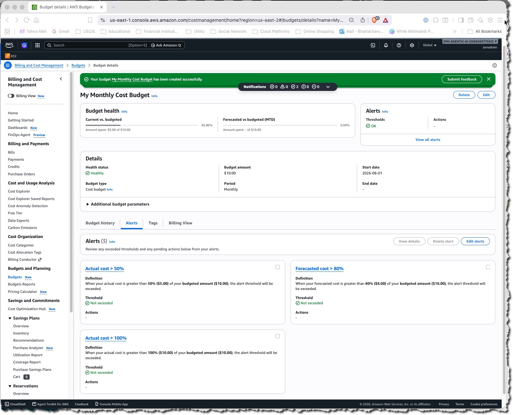

# Assignment 1 — Creating an AWS Free Tier Account & Setting Up Budget Management and Alerts

Part of the DevOps Micro Internship (DMI) Cohort 3 with Agentic AI

---

## Purpose

In this assignment, you will create your own AWS Free Tier account and configure budget management with cost alerts. This is an important first step: it lets you follow along with the rest of the course, and the alerts help ensure you do not exceed your budget.

---

# Task 1 — Sign Up for AWS and Access the Console

## Goal

Create your AWS Free Tier account, select the Basic Support Plan (Free), and log in to the AWS Management Console.

> No screenshot required for this task. Completion is verified through Task 2.

---

# Task 2 — Create a Monthly Cost Budget with Alerts

## Goal

In the Billing Dashboard, create a monthly Cost Budget with a name, amount, and start month, then configure alert thresholds (e.g. 50%, 80%, 100%) and a notification email address.

### Evidence

#### Screenshot 1 — AWS Budget setup page showing the budget name, budget amount, and alert thresholds

---

### Notes

Answer the following in your own words:

**1. Why is it important to set up budget alerts when using an AWS account?**

Setting up budget alerts is important for several key reasons:

#### Cost Visibility and Control

Budget alerts give you real-time visibility into your AWS spending. Without them, you might not realize how much you're actually spending until your monthly bill arrives. Alerts allow you to catch excessive spending early and take corrective action before costs spiral.

#### Preventing Bill Shock

AWS charges based on usage, which means costs can grow unexpectedly if resources aren't managed properly. A development instance left running overnight, an unoptimized database query running continuously, or a data transfer you weren't anticipating can quickly add up. Alerts act as an early warning system.

#### Identifying Resource Leaks

A sudden spike in your bill often signals a problem—like an EC2 instance that wasn't terminated, an unattached EBS volume accumulating charges, or a database backup running repeatedly. Budget alerts prompt you to investigate these anomalies quickly.

#### Enforcing Accountability

In team environments, budget alerts create transparency around spending. When team members know there are spending thresholds and notifications, they're more likely to clean up unused resources and think carefully about their infrastructure choices.

#### Supporting Business Planning

By tracking spending patterns through alerts, you can better forecast future costs, understand which projects or departments consume the most resources, and make informed decisions about cloud investment and optimization efforts.

#### Summary

Budget alerts are a critical governance tool that helps you maintain cost discipline, prevent surprises, and ensure your cloud infrastructure remains efficient and aligned with your business goals.

---

# Submission Instructions

- Add the required screenshot in your submission
- Do not expose sensitive billing, card, identity, or account information

---

# Completion Checklist

- [x] AWS Free Tier account created and Basic Support Plan (Free) selected
- [x] Logged in to the AWS Management Console
- [x] Monthly Cost Budget created with name, amount, and start month
- [x] Budget alert thresholds and notification email configured
- [x] Screenshot captured showing budget name, amount, and thresholds (Screenshot 1)
- [x] Notes question answered
- [x] No sensitive billing or account information exposed

---

## 📌 About DMI & CloudAdvisory

DevOps Micro Internship (DMI) is a project-based DevOps program run by Pravin Mishra (The CloudAdvisory) focused on real-world execution, systems thinking, and career readiness.

It helps learners build strong DevOps foundations with hands-on experience.

---

## 📌 Resources

- 🌐 DMI Official Website: https://dmi.pravinmishra.com?utm_source=github&utm_medium=readme  
- 🎓 University: https://university.pravinmishra.com?utm_source=github&utm_medium=readme  
- 💬 Discord Community: https://discord.pravinmishra.com?utm_source=github&utm_medium=readme  
- 📝 Blog: https://dmi.pravinmishra.com/blog?utm_source=github&utm_medium=readme  
- ▶️ YouTube Playlist: https://www.youtube.com/playlist?list=PLFeSNDtI4Cho  
- 🔗 Pravin Mishra (LinkedIn): https://www.linkedin.com/in/pravin-mishra-aws-trainer/  
- 🏢 CloudAdvisory (LinkedIn): https://www.linkedin.com/company/thecloudadvisory/

---

*This submission is part of DevOps Micro Internship (DMI) Cohort 3 — Agentic AI Track.*